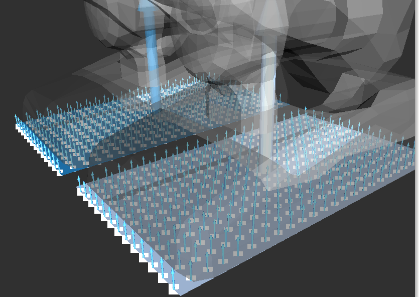

# PolygonPointsSampler


Sampling points with fixed grid size on polygons.

## Subscribing Topic
* `~input/polygons` (`jsk_recognition_msgs/PolygonArray`)
* `~input/coefficients` (`jsk_recognition_msgs/ModelCoefficientsArray`)

  Input polygons where be sampled


## Publishing Topic
* `~output` (`sensor_msgs/PointCloud2`)

  Sampled pointcloud (`pcl::PointXYZRGBNormal`).

* `~output_xyz` (`sensor_msgs/PointCloud2`)

  Sampled pointcloud (`pcl::PointXYZ`).


## Parameters
* `~grid_size` (Double, default: `0.01`)

  Sampling grid size in [m].

  This parameter can be changed by `dynamic_reconfigure`.


## Sample

```bash
roslaunch jsk_pcl_ros_utils sample_polygon_points_sampler.launch
```
