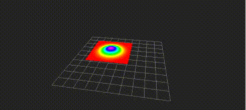

# PoseWithCovarianceStampedToGaussianPointCloud


Visualize `geometry_msgs/PoseWithCovarianceStamped` as gaussian pointcloud.
Pointcloud is computed within a region of 3 sigma.

## Subscribing Topics
* `~input` (`geometry_msgs/PoseWithCovarianceStamped`)

  Input pose

## Publishing Topics
* `~output` (`sensor_msgs/PointCloud2`)

  Output pointcloud

## Parameters
* `~cut_plane` (String, default: `xy`)

  You can choose a plane to compute gaussian distribution from `xy`, `yz`, `zx`,
  `flipped_xy`, `flipped_yz` or `flipped_zx`.

* `~sampling_num` (Int, default: `100`)

  The number of sampling for each axis. The number of points will square of `~sampling_num`.

* `~normalize_method` (String, default: `normalize_area`)
* `~normalize_value` (Float, default: `1.0`)

  You can choose `normalize_area` or `normalize_height` as a method to normalize gaussian distribution.

  If you choose `normalize_area`, area of gaussian distribution will be `~normalize_value`.

  If you choose `normalize_height`, the maximum height of gaussian distribution will be `~normalize_value`.

## Sample

```bash
roslaunch jsk_pcl_ros_utils sample_pose_with_covariance_stamped_to_gaussian_pointcloud.launch
```
