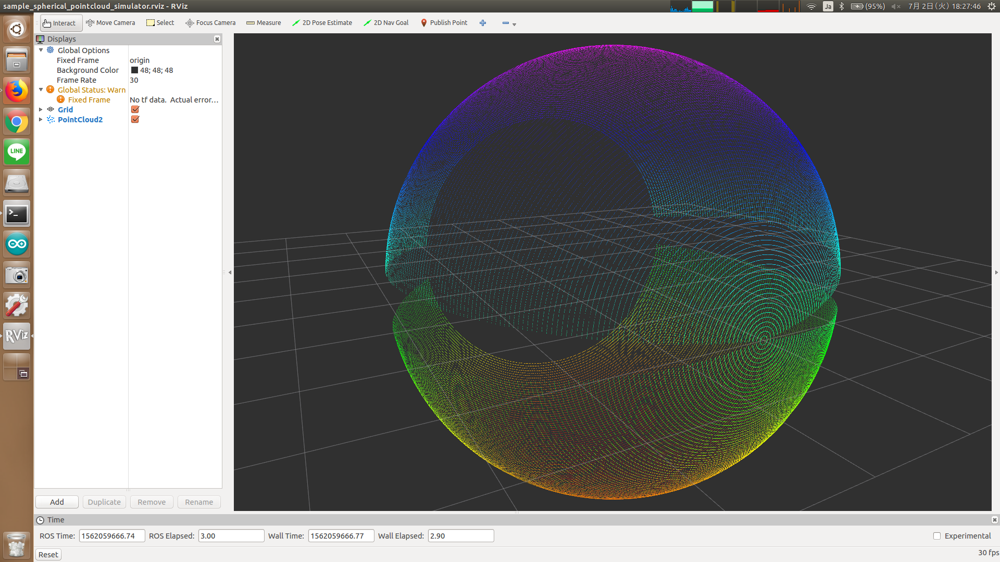

# SphericalPointCloudSimulator



Simulate a pointcloud which is acquired by 3D laser range finder such as tilt laser in PR2.

## Subscribing Topics
* `~input` (`sensor_msgs/PointCloud2`)

  Trigger message to simulate pointcloud.

  Only timestamp of this message will be used.


## Publishing Topics
* `~output` (`sensor_msgs/PointCloud2`)

  Simulated spherical pointcloud.


## Parameters
* `~rate` (Float, default: `None`)

  If this parameter is specified, this node will publish `~output` at this rate [Hz],
  in addition to callback of `~input`.

* `~frame_id` (String, default: `~input.header.frame_id`)

  Frame ID of `~output`.

* `~r` (Float, default: `3.0`)

  Radius of spherical point cloud in [m].

  This parameter can be changed by `dynamic_reconfigure`.

* `~min_phi` (Float, default: `0.0`)
* `~max_phi` (Float, default: `3.14`)

  Minimum/maximum rotation angle of scanning in [rad].

  These parameters can be changed by `dynamic_reconfigure`.

* `~scan_range` (Float, default: `4.71`)

  Range of each scan in [rad].

  This parameter can be changed by `dynamic_reconfigure`.

* `~scan_num` (Int, default: `1081`)

  Number of distance observation in each scan.

  This parameter can be changed by `dynamic_reconfigure`.

* `~fps` (Float, default: `40.0`)

  Rate of observing each scan in [Hz].

  This parameter can be changed by `dynamic_reconfigure`.


## Sample

```bash
roslaunch jsk_pcl_ros_utils sample_spherical_pointcloud_simulator.launch
```
