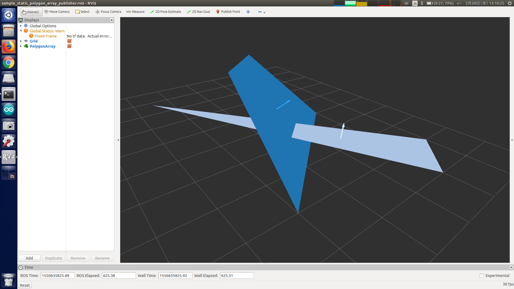

# StaticPolygonArrayPublisher

## What Is This


Publish static polygons.


## Subscribing Topic

* `~input` (`sensor_msgs/PointCloud2`)

  Point cloud topic whose header is used for timestamp of output topics.

* `~trigger` (`jsk_recognition_msgs/Int32Stamped`)

  Trigger topic for publishing outputs.


## Publishing Topic

* `~output_polygons` (`jsk_recognition_msgs/PolygonArray`)

  Polygon array.

* `~output_coefficients` (`jsk_recognition_msgs/ModelCoefficientsArray`)

  Normal array of polygons.


## Parameter

* `~use_periodic` (Bool, default: `False`)

  Enable timer publishing or not.

* `~use_message` (Bool, default: `False`)

  Enable publishing when `~input` is subscribed.

* `~use_trigger` (Bool, default: `False`)

  Enable publishing when `~input` and `~trigger` are synchronously subscribed.

Note that at least one of these 3 parameters must be set to true.

* `~periodic_rate` (Float, default: `10.0`)

  Publishing rate [Hz] used when `~use_periodic` is true.

* `~frame_ids` (List of String, __required__)

  Frame ID of each polygon.

* `~polygon_array` (List of List of List of Float, __required__)

  Polygon array.

  Each polygon is composed of multiple (>=3) vertices, each of which is 3D point.

  Example of `~polygon_array` is below.

  ```yaml
  polygon_array:
    - [[3, 0, 0], [0, 3, 0], [0, 1, 2], [1, 0, 2]]
    - [[-1, -1, 1], [4, 3, 0], [3, 4, 0]]

  ```


## Sample

```bash
roslaunch jsk_pcl_ros_utils sample_static_polygon_array_publisher.launch
```
