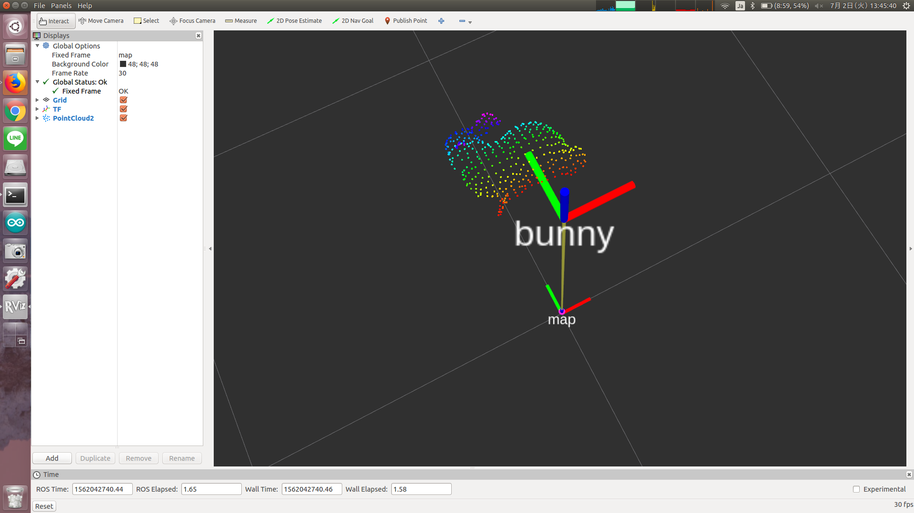

# TfTransformCloud



## What Is This

This nodelet will republish the pointcloud which is transformed with the designated frame_id.

## Topics
* Input
  * `~input` (`sensor_msgs/PointCloud2`): input pointcloud
* Output
  * `~output` (`sensor_msgs/PointCloud2`): output pointcloud.

## Parameters
* `~target_frame_id` (string, required)

  The frame_id to transform pointcloud.

* `~duration` (Double, default: `1.0`)

  Second to wait for transformation

* `~use_latest_tf` (Bool, default: `false`)

  If this parameter is true, ignore timestamp of tf to transform pointcloud.

* `~tf_queue_size` (Int, default: `10`)

  Queue size of tf message filter to synchronize tf and `~input` topic.

## Sample

```bash
roslaunch jsk_pcl_ros_utils sample_tf_transform_cloud.launch
```
