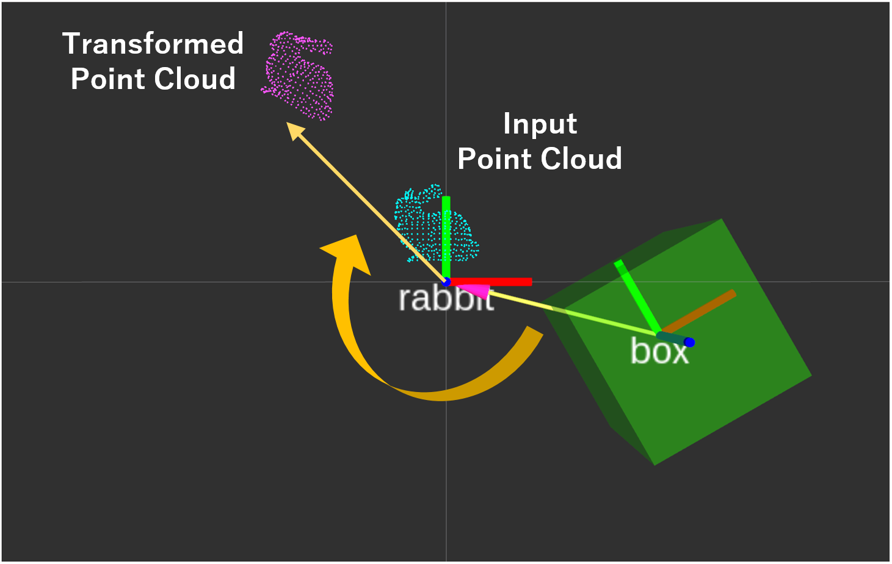

# TransformPointcloudInBoundingBox

## What Is This


Move input point cloud away from input bounding box.


## Subscribing Topic

* `~input` (`sensor_msgs/PointCloud2`)

  Input point cloud to move.

* `~input_box` (`jsk_recognition_msgs/BoundingBox`)

  Input bounding box from which `~input` is moved away.


## Publishing Topic

* `~output` (`sensor_msgs/PointCloud2`)

  Moved point cloud.

* `~output_offset` (`geometry_msgs/PoseStamped`)

  This topic is advertised, but currently not published.


## Sample

```bash
roslaunch jsk_pcl_ros_utils sample_transform_pointcloud_in_bounding_box.launch
```
