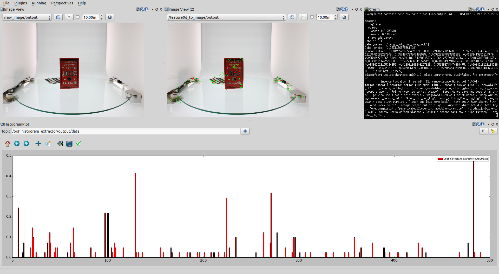

Bag of Features for Object Recognition
======================================

|image0| (Demo of recognizing oreo snack from novel image input.)

Tools
-----

- scripts/create_sift_dataset.py

  - extract SIFT descriptor features from images.
  - the input data path format should be like below:

::

    ──image_dataset
       ├── champion_copper_plus_spark_plug
       │   ├── img0000.jpg
       │   ├── img0001.jpg
       │   ├── img0002.jpg
       │   ...
       ├── cheezit_big_original
       ├── crayola_64_ct
       ├── dr_browns_bottle_brush
       ...

- scripts/create_bof_dataset.py

  - extract BoF from descriptor features.
  - extract BoF Histogram from descriptor features.

- scripts/sklearn_classifier_trainer.py

  - train classifier in `scikit-learn <http://scikit-learn.org>`_ with specified dataset and classifier model.

Example
-------

.. code:: sh

    $ roscd jsk_perception/data

    # download sample data
    $ sudo pip install gdown
    $ gdown "https://drive.google.com/uc?id=0B9P1L--7Wd2vNm9zMTJWOGxobkU&export=download" \
        -O 20150428_collected_images.tgz

    # create descriptors dataset
    $ tar zxf 20150428_collected_images.tgz
    $ rosrun jsk_perception create_sift_dataset.py 20150428_collected_images

    # extract Bag of Features & its histogram
    $ rosrun jsk_perception create_bof_dataset.py extract_bof 20150428_collected_images_sift_feature.pkl.gz
    $ rosrun jsk_perception create_bof_dataset.py extract_bof_histogram 20150428_collected_images_sift_feature.pkl.gz \
        `rospack find jsk_perception`/trained_data/apc2015_sample_bof.pkl.gz \
        -O `rospack find jsk_perception`/trained_data/apc2015_sample_bof_hist.pkl.gz

    # train classifier
    $ rosrun jsk_perception sklearn_classifier_trainer.py \
        `rospack find jsk_perception`/trained_data/apc2015_sample_bof_hist.pkl.gz \
        -O `rospack find jsk_perception`/trained_data/apc2015_sample_clf.pkl.gz

    # run for novel image
    $ roslaunch jsk_perception sample_bof_object_recognition.launch

    # check the result
    $ rostopic echo /sklearn_classifier/output
    data: oreo_mega_stuf
    ...

