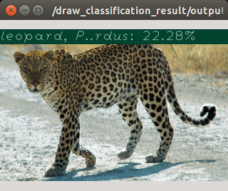

alexnet_object_recognition.py
=============================

What is this?
-------------

Recognize object with Alex net by resizing input image to 227 x 227.
This node requires pretrained `chainer <https://github.com/chainer/chainer>`_ model.
For training Alex net, please refer to `chainer imagenet example <https://github.com/chainer/chainer/tree/master/examples/imagenet>`_

Subscribing Topic
-----------------

* ``~input`` (``sensor_msgs/Image``)

  Input image.

Publishing Topic
----------------

* ``~output`` (``jsk_recognition_msgs/ClassificationResult``)

  Classification result of input image.

* ``~debug/net_input`` (``sensor_msgs/Image``)

  Resized image to 227 x 227.

Parameters
----------

* ``~gpu`` (Int, Default: ``-1``)

  GPU id. ``-1`` represents CPU mode.

* ``~target_names`` (List of String, Required)

  Target names for classification.

* ``~model_name`` (String, Required)

  Currently ``alex`` or ``alex_batch_normalization`` is only supported.
  See models in ``$(rospack find jsk_recognition_utils)/python/jsk_recognition_utils/chainermodels``.

* ``~model_file`` (String, Required)

  Trained model file.

* ``use_mask`` (Bool, Default: ``False``)

  If true, topic ``~input/mask`` is enabled.

* ``~approximate_sync`` (Bool, Default: ``False``)

  Use approximate synchronization policy.

* ``~queue_size`` (Int, Default: ``10``)

  Queue size for synchronization.

* ``~slop`` (Float, Default: ``0.1``)

  Slop for approximate sync.

Example
-------

.. code-block:: bash

   roslaunch jsk_perception sample_alexnet_object_recognition.launch
