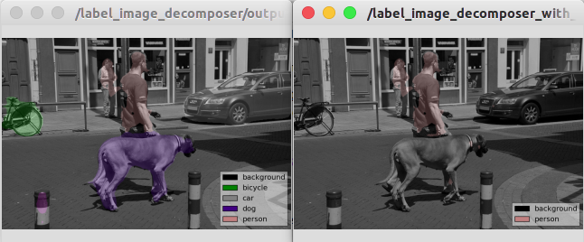

apply_context_to_label_probability
==================================

What is this?
-------------

Apply context as label candidates to label probability image.
The probabilities of labels other than the candidates are set as 0.

Subscribing Topic
-----------------

* ``~input`` (``sensor_msgs/Image``)

  Label probability image.

* ``~input/candidates`` (``jsk_recognition_msgs/LabelArray``)

  Array of candidates label to update ``~candidates``.

Publishing Topic
----------------

* ``~output`` (``sensor_msgs/Image``)

  Label probability image after the context is applied.

* ``~output/label`` (``sensor_msgs/Image``)

  Label image after the context is applied.

Advertising Service
-------------------

* ``~update_candidates`` (``jsk_recognition_msgs/SetLabels``)

  Update ``~candidates`` like you do so with dynamic_reconfigure.
  (List of string is not supported in current dyncmic_reconfigure)

Parameters
----------

* ``~candidates`` (List of String, default: ``[]``)

  If no candidates are provided,
  this node does nothing and just transports the input msg.

* ``~candidates_fixed`` (List of String, default: ``[]``)

  Candidates that never changed by services or topics.

Sample
------

.. code-block:: bash

  roslaunch jsk_perception sample_apply_context_to_label_probability.launch
