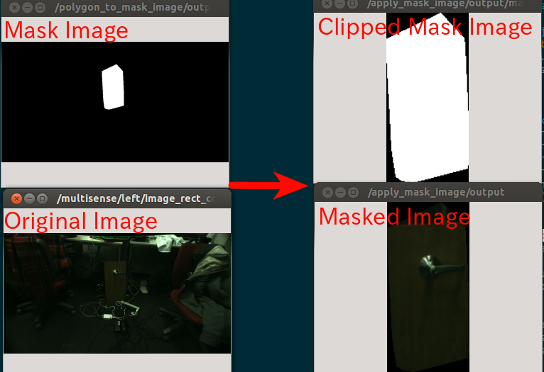

# ApplyMaskImage


Apply mask image to original image and visualize it. It's a utlity to visualize mask image.

## Subscribing Topic
* `~input` (`sensor_msgs/Image`)

  Original image.
* `~input/mask` (`sensor_msgs/Image`)

  Mask image.
## Publishing Topic
* `~output` (`sensor_msgs/Image`)

  Masked image. The image is clipped by bounding box of mask image and filtered by the mask.
  The region not specified by mask image is filled by 0.
* `~output/mask` (`sensor_msgs/Image`)

  Clipped mask image. The image is clipped by bounding box of mask image.

## Parameters
* `~approximate_sync` (Bool, default: `false`)

  Approximately synchronize inputs if it's true.

* `~negative` (Bool, default: `false`)

  Flip the max region of mask image or not.

* `~clip` (Bool, default: `true`)

  Clip the max region of mask image or not.

* `~negative/before_clip` (Bool, default: `true`)

  This decides order of negative and clip.
  If true, negative process is before clipping.

* `~queue_size` (Int, default: `100`)

  How many messages you allow about the subscriber to keep in the queue.
  This should be big when there is much difference about delay between two topics.

* `~cval` (Int, default: `0`)

  Used to fill image before masking with input image and mask.

* `~mask_black_to_transparent` (Bool, default: `false`)

  Change black region of mask image to transparent and publish RGBA8 image as `~output` if its' true.

## Sample

```bash
roslaunch jsk_perception sample_apply_mask_image.launch
```
