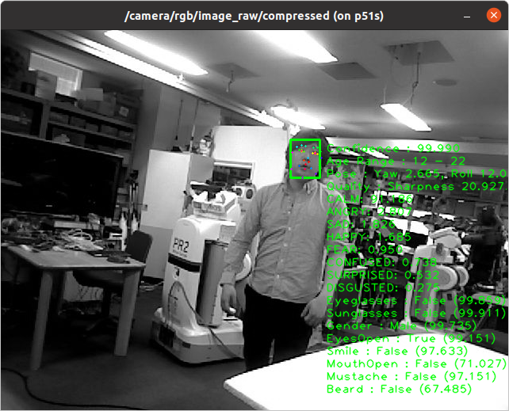

aws_detect_faces.py
===================

What is this?
-------------

Detect faces within an images using Amazon Rekognition.
Please refer to `DetectFaces <https://github.com/awsdocs/amazon-rekognition-developer-guide/blob/master/doc_source/API_DetectFaces.md>`_.

Subscribing Topic
-----------------

* ``image/compressed`` (``sensor_msgs/CompressedImage``)

  Input image.
  This topic name is resolved from ``image``.

Publishing Topic
----------------

* ``~faces`` (``opencv_apps/FaceArrayStamped``)

  Detected face positions, facial landmarks, emotions, presence of beard, sunglasses, and so on.

* ``~poses`` (``geometry_msgs/PoseArray``)

  Pose of the face as determined by its pitch, roll, and yaw. The pose is published in Quaternion, to reconstruct Roll, Pitch, Yaw, use following codes.

.. code-block:: bash

  import math
  import rospy
  from geometry_msgs.msg import PoseArray

  from tf.transformations import euler_from_quaternion

  def cb(msg):
      for pose in msg.poses:
          angles = euler_from_quaternion([pose.orientation.x, pose.orientation.y, pose.orientation.z, pose.orientation.w])
          print("roll: {}, pitch: {}, yaw: {}".format(angles[0]*180/math.pi,angles[1]*180/math.pi,angles[2]*180/math.pi))

  if __name__ == '__main__':
      rospy.init_node('pose_example')
      rospy.Subscriber('/aws_detect_faces/poses', PoseArray, cb)
      rospy.spin()

* ``~attributes`` (``jsk_recognition_msgs/ClassificationResult``)

  Attributes of the face, such as emotions, presence of beard, sunglasses, and so on, with confidence.

* ``~landmarks`` (``jsk_recognition_msgs/PeoplePoseArray``)

  The location of landmarks on the face.

* ``~output`` (``sensor_msgs/Image``)

  Visualization image of detected faces.

* ``~image`` (``sensor_msgs/Image``)

  Passthourgh input image. This message contains face detected image
  when ``~always_publish`` is false.

Parameters
----------

* ``~aws_credentials_path`` (String, Default: ``aws.json``)

  Json file for aws access key and secret key to run AWS Rekognition.
  see `Set up an AWS account and create an IAM user
  <https://docs.aws.amazon.com/rekognition/latest/dg/setting-up.html>`_
  for how to obtain keys.

.. code-block:: json

  {
      "region" : "xxxxxxxxxxxxxxxxxxxx",
      "aws_access_key_id" : "####################",
      "aws_secret_access_key" : "********************"
  }

  

* ``~attributes`` (Bool, Default: ``ALL``)

  Facial attributes you want to be returned. Set ``ALL`` to return all attributes or ``DEFAULT` to return ``BoundingBox``, ``Confidence``, ``Pose``, ``Quality``, and ``Landmarks``.

  see https://github.com/awsdocs/amazon-rekognition-developer-guide/blob/master/doc_source/API_DetectFaces.md#request-parameters more info.

* ``~use_window`` (Bool, Default: ``False``)

  Set true to display a window including detected face and attributes.

* ``~buff_size`` (Int, Default: ``614400``)

  Buffer size for  image subscription. The default buff_size of rospy.Subscriber is 65536, which does not process latest incoming image even if queue_size=1.
  See https://answers.ros.org/question/220502/image-subscriber-lag-despite-queue-1/ for more detail.

* ``~always_subscribe`` (Bool, Default: ``True``)

  Set true to process even if not one subscribing.

* ``~always_publish`` (Bool, Default: ``True``)

  Set false to publish only when face is detected.

Example
-------

.. code-block:: bash

   roslaunch jsk_perception sample_aws_detect_faces.launch

   Optional Arguments:
     attributes (default "ALL"): set either ALL or DEFAULT for returning attributes
     use_usb_cam (default "false"): set true to use USB camera image as input
     use_window (default "true"): set false if you do not want to display window

For JSK user, Download `aws.json` file from
`Gdrive <https://drive.google.com/file/d/1g9DopJACY0rphGUiU9YGVMdzAPLRsuIk/view?usp=sharing>`_
and put this under `/tmp` directory to run sample code.
