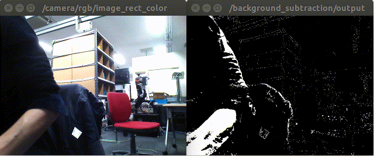

BackgroundSubstraction
======================

What is this?
-------------

Extract moving foreground from static background.

Subscribing Topic
-----------------

* ``~image`` (``sensor_msgs/Image``)

  Input image.

Publishing Topic
----------------

* ``~output`` (``sensor_msgs/Image``)

  Output mask image regarded as moving foreground.

Sample
------

.. code-block:: bash

  roslaunch jsk_perception sample_background_subtraction.launch
