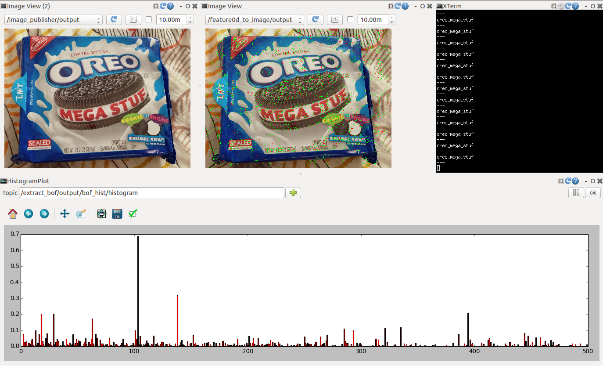

# Bag_of_Feature_for_ObjectRecognition

(Demo of recognizing oreo snack from novel image input.)

## Tools
* scripts/create\_feature0d\_dataset.py, launch/create\_feature0d\_dataset.launch
    * extract descriptor features from images.
    * the input data path format should be like below:

```
──image_dataset
   ├── champion_copper_plus_spark_plug
   │   ├── img0000.jpg
   │   ├── img0001.jpg
   │   ├── img0002.jpg
   │   ...
   ├── cheezit_big_original
   ├── crayola_64_ct
   ├── dr_browns_bottle_brush
   ...
```

* scripts/extract\_bof.py
    * extract BoF from descriptor features. (see --help for more)

## Example
```sh
# donwload sample data
$ roscd jsk_data && make large KEYWORD:=jsk_2014_picking_challenge/20150428_collected_images
$ wget https://i.warosu.org/data/ck/img/0048/57/1381305564234.jpg -O /tmp/oreo_mega_stuf_sample.jpg
# create descriptors dataset
$ roslaunch jsk_perception create_feature0d_dataset.launch container_path:=`rospack find jsk_data`/large/20150428_collected_images
# extract bag of features & its histogram
$ rosrun jsk_perception extract_bof.py fit `rospack find jsk_perception`/trained_data/feature0d_dataset.pkl.gz -O `rospack find jsk_perception`/trained_data/bof.pkl.gz
$ rosrun jsk_perception extract_bof.py dataset `rospack find jsk_perception`/trained_data/feature0d_dataset.pkl.gz `rospack find jsk_perception`/trained_data/bof.pkl.gz -O `rospack find jsk_perception`/trained_data/bof_hist.pkl.gz
# train classifier
$ rosrun jsk_perception simple_classifier_trainer.py `rospack find jsk_perception`/trained_data/bof_hist.pkl.gz -O `rospack find jsk_perception`/trained_data/clf.pkl.gz
# run for novel image
$ roscore
$ rosrun jsk_perception image_publisher.py _file_name:=/tmp/oreo_mega_stuf_sample.jpg
$ rosrun imagesift imagesift image:=/image_publisher/output
$ rosrun jsk_perception extract_bof.py extract `rospack find jsk_perception`/trained_data/bof.pkl.gz
$ rosrun jsk_perception simple_classifier.py _clf_path:=`rospack find jsk_perception`/trained_data/clf.pkl.gz
# check the result
$ rostopic echo /simple_classifier/output
data: oreo_mega_stuf
...
```
