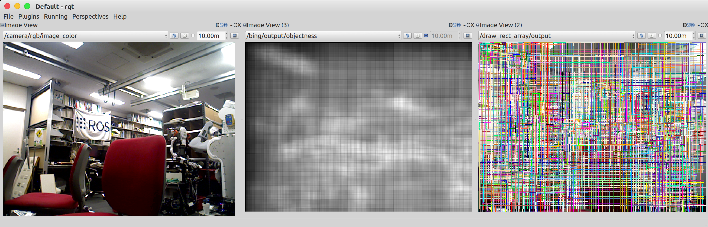

Bing
====

What is this?
-------------

Compute objectness in a image frame, and publishes object proposals.

.. note:: This node is supported only when OpenCV3 is installed.

Subscribing Topic
-----------------

* ``~input`` (``sensor_msgs/Image``)

  Raw image.

Publishing Topic
----------------

* ``~output`` (``jsk_recognition_msgs/RectArray``)

  Object proposals.

* ``~output/objectness`` (``sensor_msgs/Image``, encoding: ``32FC1``)

  Float image which describes objectness.

Sample
------

.. code-block:: bash

  roslaunch jsk_perception bing.test

Reference
---------

::

  @inproceedings{BingObj2014,
    title={{BING}: Binarized Normed Gradients for Objectness Estimation at 300fps},
    author={Ming-Ming Cheng and Ziming Zhang and Wen-Yan Lin and Philip H. S. Torr},
    booktitle={IEEE CVPR},
    year={2014},
  }
