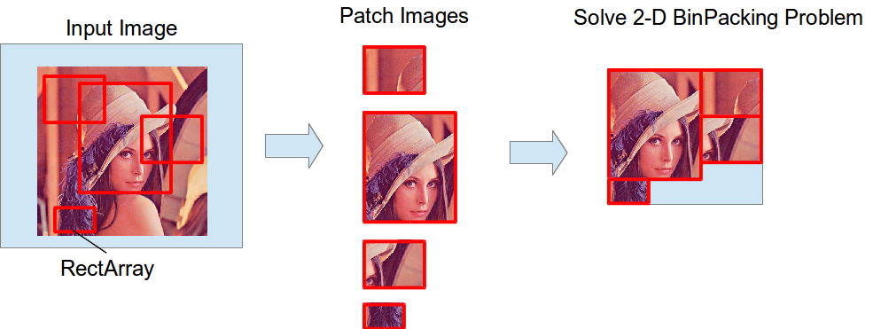

# binpack_rect_array.py


Pack `jsk_recognition_msgs/RectArray` to one image by solving 2-D binpack problem.

## Subscribing Topics
* `~input` (`sensor_msgs/Image`)

  Input image
* `~input/rect_array` (`jsk_recognition_msgs/RectArray`)

  Input array of bounding box regions

## Publishing Topics
* `~output` (`sensor_msgs/Image`)

  Output image

## Parameters
* `~approximate_sync` (default: `false`)

  Synchronize `~input` and `~input/rect_array` with approximate time sync.

## Sample

```bash
roslaunch jsk_perception sample_binpack_rect_array.launch
```
