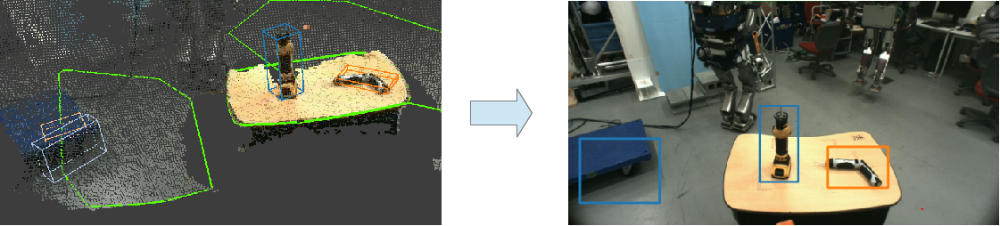
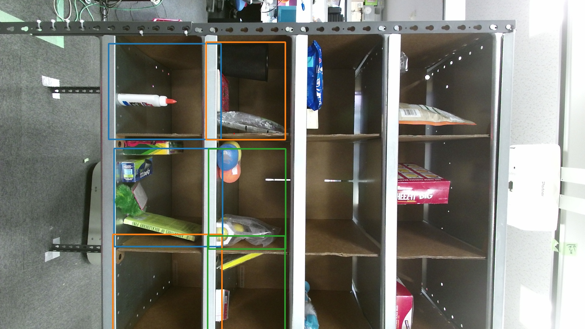

# BoundingBoxToRect


Convert `jsk_recognition_msgs/BoundingBoxArray` to `jsk_recognition_msgs/RectArray`.

## Subscribing Topics
* `~input` (`jsk_recognition_msgs/BoundingBoxArray`)

  Input bounding boxes.
* `~input/info` (`sensor_msgs/CameraInfo`)

  CameraInfo to project bounding boxes.

* `~internal` (`jsk_recognition_msgs/BoundingBoxArrayWithCameraInfo`)

  Internal topic to synchronize timestamp of `~input` and `~input/info`.

## Publishing Topics
* `~output` (`jsk_recognition_msgs/RectArray`)

  Projected 2-D bounding box.

* `~internal` (`jsk_recognition_msgs/BoundingBoxArrayWithCameraInfo`)

## Parameters
* `~approximate_sync` (Bool, default: `false`)

  Approximately synchronize `~input/src1` and `~input/src2` if it's true.

* `~queue_size` (Int, default: `100`)
  How many messages you allow about the subscriber to keep in the queue.

## Example


```
rosrun jsk_perception install_test_data.py
roslaunch jsk_perception sample_bounding_box_to_rect.launch
```
