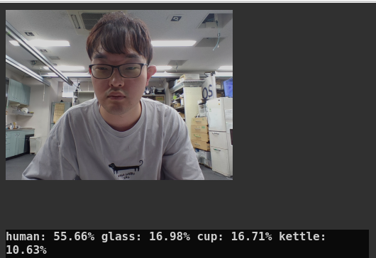

# classification_node.py



The ROS node for Classification with CLIP.

## System Configuration


This node requires to work with the Docker Container for inference. Please build the container at first following Setup instruction.

### Prerequisite
This node requires NVIDIA GPU and more than 4GB GRAM to work properly.
You have to install nvidia-container-toolkit for using GPU with docker. Please follow [official instruction](https://docs.nvidia.com/datacenter/cloud-native/container-toolkit/install-guide.html).

### Build the docker image
You have to build the docker image of OFA

```shell
roscd jsk_perception/docker
make
```

## Subscribing topic
* `~image` (`sensor_msgs/Image`)

  Input image

## Publishing topic
* `~result` (`jsk_recognition_msgs/ClassificationResult`)
  
  Classification result
  
* `~result/image` (`sensor_msgs/Image`)
  
  Images used for inference
  
* `~visualize` (`std_msgs/String`)

  Classification result to visualize
  
## Action topic
* `~inference_server/goal` (`jsk_recognition_msgs/ClassificationTaskActionGoal`) 
  
  Classification request with custom categories and image
  
* `~inference_server/result` (`jsk_recognition_msgs/ClassificationTaskActionResult`)
  
  Clasification result of `~inference_server/goal`

## Parameters
* `~host` (String, default: `localhost`)

  The host name or IP of inference container 

* `~port` (Integer, default: `8080`)

  The HTTP port of inference container

## Dynamic Reconfigure Parameters
* `~queries` (string, default: `human;kettle;cup;glass`) 

  Default categories used for subscribing image topic. 

  You can send multiple queries with separating semicolon.

### Run inference container on another host or another terminal
In the remote GPU machine,
```shell
cd jsk_recognition/jsk_perception/docker
./run_jsk_vil_api clip --port (Your vacant port)
```

In the ROS machine,
```shell
roslaunch jsk_perception classification.launch port:=(Your inference container port) host:=(Your inference container host) CLASSIFICATION_INPUT_IMAGE:=(Your image topic name) gui:=true 
```


### Run both inference container and ros node in single host 
```
roslaunch jsk_perception classification.launch run_api:=true CLASSIFICATION_INPUT_IMAGE:=(Your image topic name) gui:=true 
```
