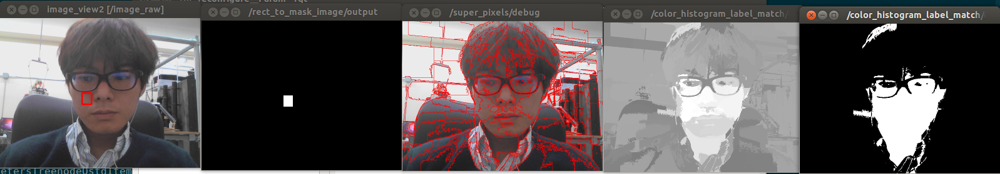

# ColorHistogramLabelMatch


Compute similar region of image to specified histogram based on superpixels image.


## Input Topic
* `~input/histogram` (`jsk_recognition_msgs/ColorHistogram`)

  Reference histogram.

* `~input` (`sensor_msgs/Image`)

  Input image. This image should be bgr8 or rgb8 image.

* `~input/label` (`sensor_msgs/Image`)

  Label of `~input` image. Label image should be int32 image.

* `~input/mask` (`sensor_msgs/Image`)

  Mask image of `~input` image. Only masked region is taken into account.


## Publishing Topic
* `~output/extracted_region` (`sensor_msgs/Image`)

  Result of correlation computation as mask image.

* `~output/coefficient_image` (`sensor_msgs/Image`)

  Result of correlation computation as float image.

* `~debug` (`sensor_msgs/Image`)

  Debug image


## Parameters
* `~coefficient_method` (Int, Default: `0`)

  Method to compute coefficient.

  Choose from `correlancy (0)`, `chi_squared (1)`, `intersect (2)`,
  `bhattacharyya (3)`, `EMD_Manhattan (4)` and `EMD_Euclid (5)`.

  This parameter can be changed by `dynamic_reconfigure`.

* `~max_value` (Int, Default: `255`)
* `~min_value` (Int, Default: `0`)

  Maximum and minimum index of histogram

  These parameters can be changed by `dynamic_reconfigure`.

* `~masked_coefficient` (Float, Default: `0.0`)

  Value to fill masked region

  This parameter can be changed by `dynamic_reconfigure`.

* `~threshold_method` (Int, Default: `0`)

  Method to binalize coefficient image.

  Choose from `smaller_than (0)`, `greater_than (1)`, `otsu (2)` and `otsu_inv (3)`.

  This parameter can be changed by `dynamic_reconfigure`.

* `~coef_threshold` (Float, Default: `0.8`)

  Threshold used in binalization.

  This parameter can be changed by `dynamic_reconfigure`.

* `~use_mask` (Default: `false`)

  Do not use mask image if this parameter is false.


## Sample

```bash
roslaunch jsk_perception sample_color_histogram_label_match.launch
```
