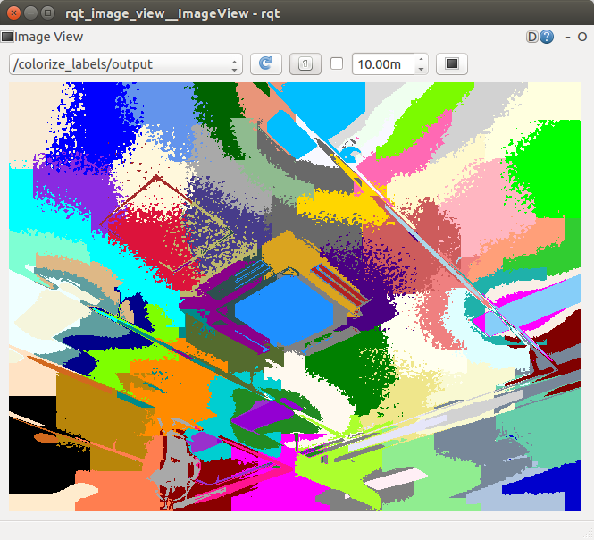

# ColorizeLabels



Put colors on the subscribed topic of labeling result

## Subscribing Topic
* `~input` (`sensor_msgs/Image`)

input datatype is `sensor_msgs/Image` but not for normal color image but for labeling result container


## Publishing Topic
* `output` (`sensor_msgs/Image`)


## Parameters
none

## Samples

### rosrun
Launch color image publisher anything you like.
```
rosrun usb_cam usb_cam_node
```

Run the labeling node anything you like.
```
rosrun jsk_perception slic_super_pixels image:=/usb_caimage_raw
```

Run this colorize_labels node with proper remapping.

```
rosrun jsk_perception colorize_labels ~input:=/slic_super_pixels/output
```

