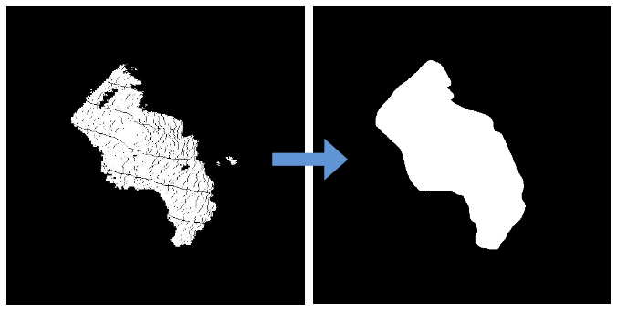

ConcaveHullMaskImage
====================

What is this?
-------------

Publish mask that is computed concave hull from the input mask.

Subscribing Topic
-----------------

* ``~input`` (``sensor_msgs/Image``)

  Input mask image.

Publishing Topic
----------------

* ``~output`` (``sensor_msgs/Image``)

  Concave hull mask image.

Parameters
----------

* ``min_area`` (Float, default: ``0``)

  Minimum area of concave.

* ``max_area`` (Float, default: ``Image's height * width``)

  Maximum area of concave.

Sample
------
::

    roslaunch jsk_perception sample_concave_hull_mask_image.launch
