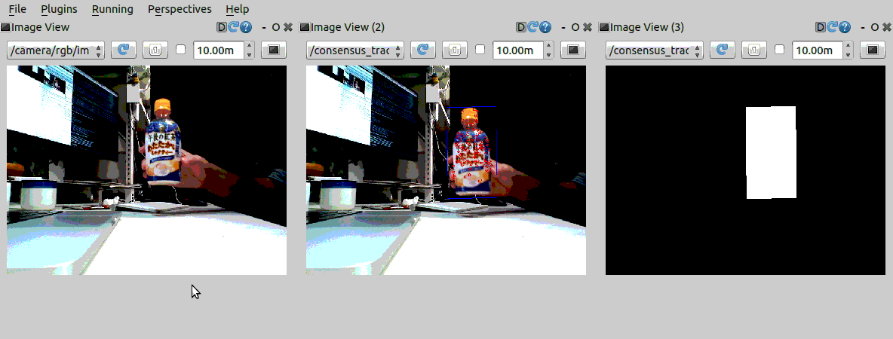

ConsensusTracking
=================

What is this?
-------------

Publishing a ROI mask of the tracking object.

Subscribing Topic
-----------------

* ``~input`` (``sensor_msgs/Image``)

  Raw image.

* ``~input/polygon`` (``geometry_msgs/PolygonStamped``)

  Initial window of object to track.

Publishing Topic
----------------

* ``~output/mask`` (``sensor_msgs/Image``)

  A ROI mask of the tracking object.

* ``~debug/image`` (``sensor_msgs/Image``)

  Debug image which has visualized keypoints and rectangle of the tracking object in frame.

Parameters
----------

* ``~queue_size`` (Int, default: ``10``)

  How many messages you allow about the subscriber to keep in the queue.
  This should be big when there is much difference about delay between two topics.

* ``~approximate_sync`` (Bool, default: ``False``)

  Whether to use approximate for input topics.

Sample
------

.. code-block:: bash

  roslaunch jsk_perception sample_consensus_tracking.launch
