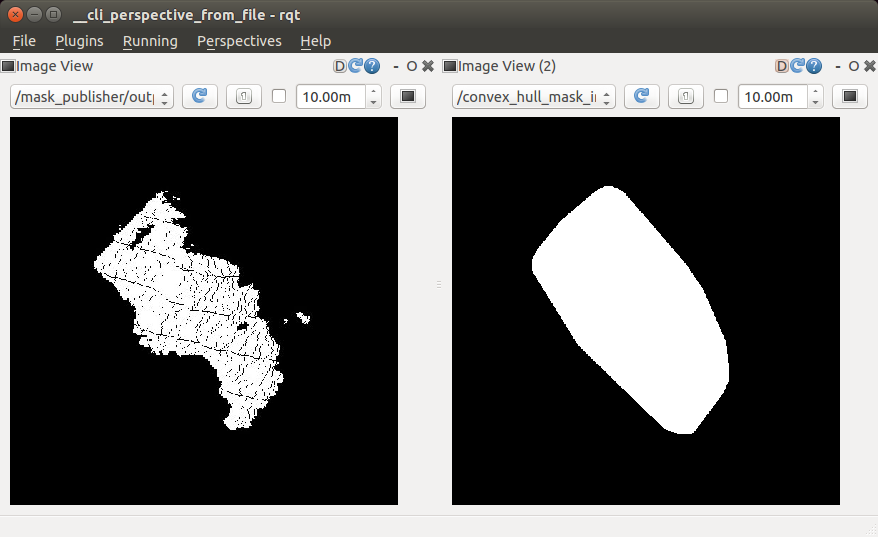

ConvexHullMaskImage
===================

What is this?
-------------

Publish mask that is computed convex hull from the input mask.

Subscribing Topic
-----------------

* ``~input`` (``sensor_msgs/Image``)

  Input mask image.

Publishing Topic
----------------

* ``~output`` (``sensor_msgs/Image``)

  Convex hull mask image.

Parameters
----------

None.

Sample
------
::

    roslaunch jsk_perception sample_convex_hull_mask_image.launch
