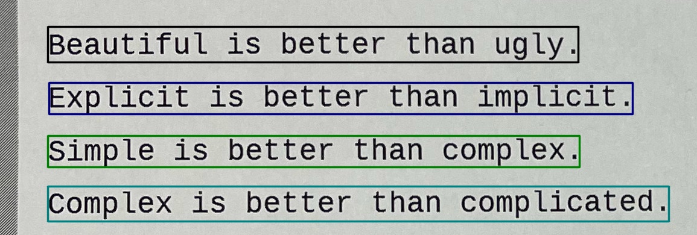

craft_node.py
=============

What is this?
-------------

Detect text region from image.
This is a ROS node for ``CRAFT: Character-Region Awareness For Text detection``.

Subscribing Topic
-----------------

* ``~input`` (``sensor_msgs/Image``)

  Raw image.

Publishing Topic
----------------

* ``~output/cluster_indices`` (``jsk_recognition_msgs/ClusterPointIndices``)

  Image indices of each detected text region.

* ``~output/rects`` (``jsk_recognition_msgs/RectArray``)

  Rectangles of detected texts.

* ``~output/polygons`` (``jsk_recognition_msgs/PolygonArray``)

  Polygons of detected texts.
  Unlike ``RectArray``, this is output as a list of points on a 2D plane.

Parameters
----------

* ``~gpu`` (Int, default: ``0``)

  GPU id.

* ``~model_path`` (String, required)

  Pretrained model path.

* ``~refine_model_path`` (String, required)

  Pretrained link refiner model path.

* ``~text_threshold`` (Double, default: ``0.70``)

  Text confidence threshold

* ``~text_low_bound_score`` (Double, default: ``0.40``)

  Text low bound score

* ``~link_threshold`` (Double, default: ``0.1``)

  Link confidence threshold

* ``~mag_ratio`` (Double, default: ``1.5``)

  Image magnification ratio.

* ``~max_image_size`` (Int, default: ``1280``)

  Max image size for inference

Sample
------

.. code-block:: bash

  roslaunch jsk_perception sample_craft_node.launch
