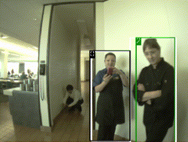

deep_sort_tracker_node.py
=========================

What is this?
-------------

Tracking objects using target bounding box.

Subscribing Topic
-----------------

* ``~input`` (``sensor_msgs/Image``)

  Raw image.

* ``~input/rects`` (``jsk_recognition_msgs/RectArray``)

  Rectangles on an input image.

* ``~input/class`` (``jsk_recognition_msgs/ClassificationResult``)

  Class labels for each rectangles.

Publishing Topic
----------------

* ``~output/labels`` (``jsk_recognition_msgs/LabelArray``)

  Tracking id labels of each tracked objects.

* ``~output/viz`` (``sensor_msgs/Image``)

  Visualized image of recognition result.

Parameters
----------

* ``~gpu`` (Int, default: ``0``)

  GPU id.

* ``~target_labels`` (List of String, default: ``None``)

  If this param is specified, tracking only specified label class.
  If this value is ``None``, use all label.

* ``~pretrained_model`` (String, required)

  Pretrained model path.

* ``~approximate_sync`` (Bool, default: ``False``)

  Whether to use approximate for input topics.

* ``~queue_size`` (Int, default: ``100``)

  How many messages you allow about the subscriber to keep in the queue.
  This should be big when there is much difference about delay between two topics.

* ``~slop`` (Float, default: ``0.1``)

  How many seconds you allow about the difference of timestamp
  when you specify ``~approximate_sync``.

Sample
------

.. code-block:: bash

  roslaunch jsk_perception sample_deep_sort_tracker.launch gpu:=0
