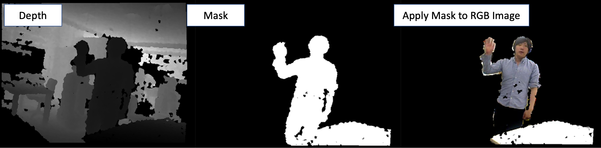

depth_image_filter.py
=====================

What is this?
-------------

Create a mask image from the distance of a depth image.

Subscribing Topic
-----------------

* ``~input`` (``sensor_msgs/Image``)

  Input depth image.

Publishing Topic
----------------

* ``~output/mask`` (``sensor_msgs/Image``)

  Mask image.

Parameters
----------

* ``~threshold`` (Float, Default: ``0.0``)

  Mask threshold. Normally, pixels with a depth value farther than this value will be masked.

* ``~negative`` (Bool, Default: ``False``)

  Extact mask or the negative.

Example
-------

.. code-block:: bash

   roslaunch jsk_perception sample_depth_image_filter.launch
