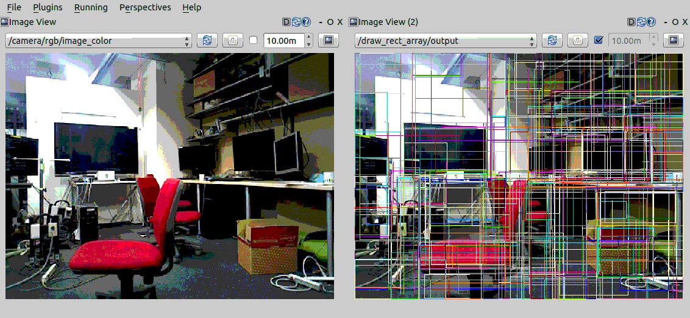
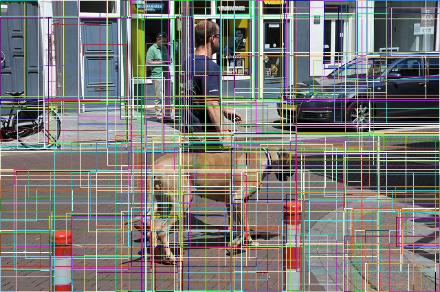

draw_rect_array.py
==================

What is this?
-------------

Publish an image topic on which rect_array is drawn.

Subscribing Topic
-----------------

* ``~input`` (``sensor_msgs/Image``)

  Raw image.

* ``~input/rect_array`` (``jsk_recognition_msgs/RectArray``)

  Object location proposals.

Publishing Topic
----------------

* ``~output`` (``sensor_msgs/Image``)

  Image on which rect_array is drawn.

Parameters
----------

* ``~approximate_sync`` (Bool, default: ``False``)

  Whether to use approximate for input topics.

* ``~queue_size`` (Int, default: ``10``)

  How many messages you allow about the subscriber to keep in the queue.
  This should be big when there is much difference about delay between two topics.

* ``~slop`` (Float, default: ``0.1``)

  How many seconds you allow about the difference of timestamp
  when you specify ``~approximate_sync``.

Example
-------

.. code-block:: bash

   roslaunch jsk_perception sample_draw_rect_array.launch
