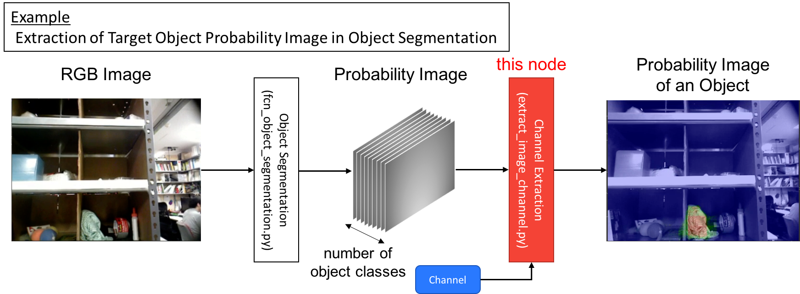

extract_image_channel.py
========================

What is this?
-------------

Extract a specified channel from input image.

Subscribing Topic
-----------------

* ``~input`` (``sensor_msgs/Image``)

  Inpu image.

Publishing Topic
----------------

* ``~output`` (``sensor_msgs/Image``)

  Image which is the extracted channel from input image.

Parameters
----------

* ``~channel`` (Int, default: ``-1``)

  The channel which is extracted from the input image.
  If negative value channel is passed the extraction is skipped.

Sample
------

.. code-block:: bash

  roslaunch jsk_perception sample_extract_image_channel.launch
