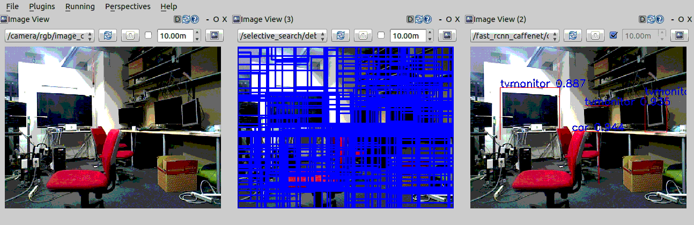
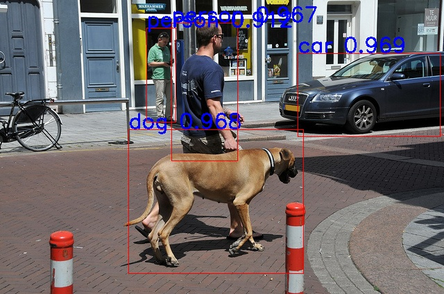

fast_rcnn_caffenet.py
=====================

What is this?
-------------

Publish an image with object bounding boxes, scores and labels.

Currently, the caffenet fast rcnn supports below objects.

::

  CLASSES = ('__background__',
             'aeroplane', 'bicycle', 'bird', 'boat',
             'bottle', 'bus', 'car', 'cat', 'chair',
             'cow', 'diningtable', 'dog', 'horse',
             'motorbike', 'person', 'pottedplant',
             'sheep', 'sofa', 'train', 'tvmonitor')

Subscribing Topic
-----------------

* ``~input`` (``sensor_msgs/Image``)

  Raw image.

* ``~input/rect_array`` (``jsk_recognition_msgs/RectArray``)

  Object location proposals.

Publishing Topic
----------------

* ``~output`` (``sensor_msgs/Image``)

  Image with bounding boxes, scores and labels for objects listed **Object Labels**.

Parameters
----------

* ``~approximate_sync`` (Bool, default: ``False``)

  Whether to use approximate for input topics.

* ``~queue_size`` (Int, default: ``10``)

  How many messages you allow about the subscriber to keep in the queue.
  This should be big when there is much difference about delay between two topics.

* ``~slop`` (Float, default: ``0.1``)

  How many seconds you allow about the difference of timestamp
  when you specify ``~approximate_sync``.

Example
-------

.. code-block:: bash

  roslaunch jsk_perception sample_fast_rcnn.launch

Install Fast-RCNN
-----------------

1. Follow the instruction `here <https://github.com/rbgirshick/fast-rcnn#installation-sufficient-for-the-demo>`_.
2. Set environmental variable ``FRCN_ROOT`` as root for fast-rcnn dir.
