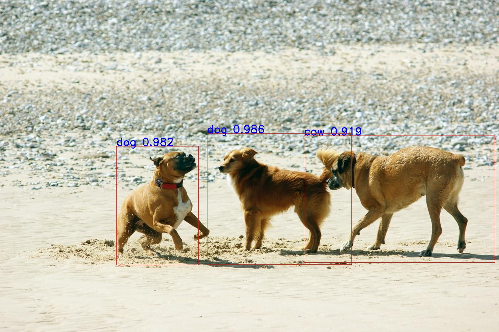
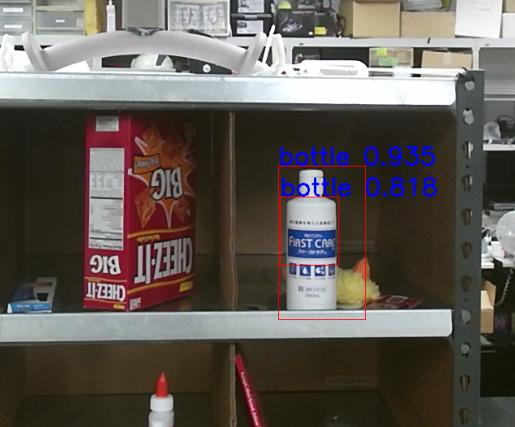

fast_rcnn_caffenet.py
=====================

What is this?
-------------

Publish an image with object bounding boxes, scores and labels.

Subscribing Topic
-----------------

* ``~input`` (``sensor_msgs/Image``)

  Raw image.

Publishing Topic
----------------

* ``~output`` (``sensor_msgs/Image``)

  Image with bounding boxes, scores and labels for objects listed **Object Labels**.

Install Fast-RCNN
-----------------

1. Follow the instruction `here <https://github.com/rbgirshick/fast-rcnn#installation-sufficient-for-the-demo>`_.
2. Set environmental variable ``FRCN_ROOT`` as root for fast-rcnn dir.

Object Labels
-------------

Currently, the caffenet fast rcnn supports below objects.

::

  CLASSES = ('__background__',
             'aeroplane', 'bicycle', 'bird', 'boat',
             'bottle', 'bus', 'car', 'cat', 'chair',
             'cow', 'diningtable', 'dog', 'horse',
             'motorbike', 'person', 'pottedplant',
             'sheep', 'sofa', 'train', 'tvmonitor')

