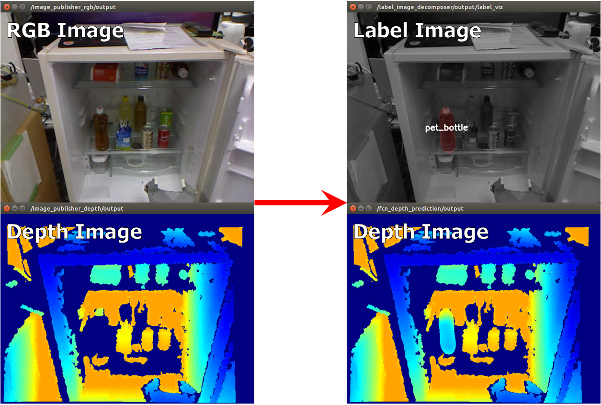

fcn_depth_prediction.py
=======================

What is this?
-------------

Predict depth of transparent object in pixel-wise with Fully Convolutional Networks.

Subscribing Topic
-----------------

* ``~input`` (``sensor_msgs/Image``)

  Raw RGB image.

* ``~input/depth`` (``sensor_msgs/Image``)

  Raw depth image.

Publishing Topic
----------------

* ``~output`` (``sensor_msgs/Image``)

  Output depth image.
  The value of each pixel is equal to ``~output/depth_pred_raw`` in the region labeled as transparent, otherwise equal to ``~input/depth``.
  The image encoding is 32FC1.

* ``~output/label`` (``sensor_msgs/Image``)

  Output label image.
  Each object is segmented according to param ``~target_names``.

* ``~output/proba_image`` (``sensor_msgs/Image``)

  Probability image of each object predicted according to param ``~target_names``.
  If the number of classes including background is XX, then the image encoding is 32FCXX.

* ``~output/depth_pred_raw`` (``sensor_msgs/Image``)

  Predicted whole depth image.
  This is used for generating ``~output``.
  The image encoding is 32FC1.

Parameters
----------

* ``~backend`` (String, Default: ``chainer``)

  Framework for neural networks.
  Currently, only ``chainer`` is supported.

* ``~gpu`` (Int, Default: ``-1``)

  GPU id. ``-1`` represents CPU mode.

* ``~target_names`` (List of String, Required)

  Target names for classification.

* ``~model_name`` (String, Required)

  Currently, ``fcn8s_depth_prediction`` and ``fcn8s_depth_prediction_concat_first`` are supported.

* ``~model_file`` (String, Required)

  Saved .npz file for trained model.

* ``~bg_label`` (Int, default: ``0``)

  Label value for background. This is used with rosparam ``~proba_threshold``

* ``~proba_threshold`` (Float, default: ``0.0``)

  Threshold for labeling pixels as uncertain, and the uncertain region
  will be labeled as background with rosparam ``~bg_label``.

* ``~queue_size`` (Int, default: ``10``)

  How many messages you allow about the subscriber to keep in the queue.
  This should be big when there is much difference about delay between two input topics.

* ``~approximate_sync`` (Bool, default: ``False``)

  Whether to use approximate for input topics.

* ``~slop`` (Float, default: ``0.1``)

  How many seconds you allow about the difference of timestamp.
  This is used only when param ``~approximate_sync`` is ``true``.

Sample
------

.. code-block:: bash

  roslaunch jsk_perception sample_fcn_depth_prediction.launch
