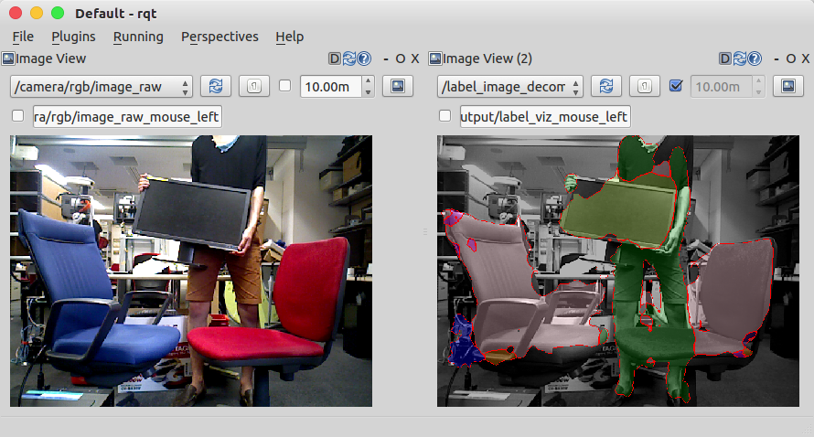
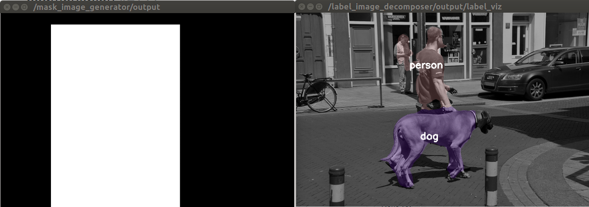

fcn_object_segmentation.py
==========================

What is this?
-------------

Segment object in pixel wise with Fully Convolutional Networks.

Subscribing Topic
-----------------

**Default**

* ``~input`` (``sensor_msgs/Image``)

  Raw image.

**Optional**

* ``~input/mask`` (``sensor_msgs/Image``)

  Mask whose black region must be the background label: ``0``.
  This topic is subscribed only when param ``~use_mask`` is ``true``.

Publishing Topic
----------------

* ``~output`` (``sensor_msgs/Image``)

  Label image each object in param ``~target_names`` is segmented.

* ``~output/proba_image`` (``sensor_msgs/Image``)

  Probability image of each object.
  The encoding is ``32FCX``, where X is the length of ``~target_names``.

Parameters
----------

**Default**

* ``~gpu`` (Int, Default: ``-1``)

  GPU id. ``-1`` represents CPU mode.

* ``~target_names`` (List of String, Required)

  Target names for classification.

* ``~backend`` (String, Default: ``chainer``)

  Neural network framework.
  Currently ``chainer`` and ``torch`` are supported.

* ``~model_name`` (String, Required)

  Currently ``fcn8s``, ``fcn8s_at_once``, ``fcn16s`` or ``fcn32s`` is only supported.
  See models in https://github.com/wkentaro/fcn/tree/master/fcn/models.

* ``~model_file`` (String, Required)

  Saved npz or h5 file for trained model.

* ``~use_mask`` (Bool, default: ``False``)

  If True, ``~input/mask`` is subscribed and ignore black region in the mask image.

* ``~bg_label`` (Int, default: ``0``)

  Label value for background. This is used with rosparam ``~proba_threshold``

* ``~proba_threshold`` (Float, default: ``0.0``)

  Threshold for labeling pixels as uncertain, and the uncertain region
  will be labeled as background with rosparam ``~bg_label``.

**Optional**

* ``~queue_size`` (Int, default: ``10``)

  How many messages you allow about the subscriber to keep in the queue.
  This should be big when there is much difference about delay between two topics.
  This is used only when param ``~use_mask`` is ``true``.

* ``~approximate_sync`` (Bool, default: ``False``)

  Whether to use approximate for input topics.
  This is used only when param ``~use_mask`` is ``true``.

* ``~slop`` (Float, default: ``0.1``)

  How many seconds you allow about the difference of timestamp.
  This is used only when param ``~use_mask`` and ``~approximate_sync`` are ``true``.

Sample
------

**Sample**

.. code-block:: bash

  roslaunch jsk_perception sample_fcn_object_segmentation.launch

.. image:: images/sample_fcn_object_segmentation.png

**Sample with mask image**

.. code-block:: bash

  roslaunch jsk_perception sample_fcn_object_segmentation.launch use_mask:=true

