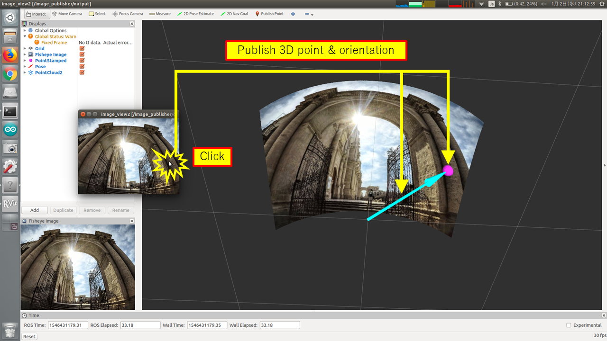

fisheye_ray.py
==============

What is this?
-------------

Subscribe a 2D point of an fisheye image and publish orientation of the point in 3D space.

Subscribing Topic
-----------------

* ``image`` (``sensor_msgs/Image``)

  Input fisheye image.

* ``clicked_point`` (``geometry_msgs/PointStamped``)

  Index of the pixel of ``image``.

  Only ``x`` and ``y`` field are used for computing orientation, and ``z`` field is ignored.

* ``camera_info`` (``sensor_msgs/CameraInfo``)

  Not used now.

Publishing Topic
----------------

* ``~output`` (``geometry_msgs/PoseStamped``)

  Orientation of ``clicked_point`` in 3D space.

* ``~output_point`` (``geometry_msgs/PointStamped``)

  3D point 1m distant from ``~frame_id`` origin, which expresses the orientation

Parameters
----------

* ``~frame_id`` (String, default: ``fisheye``)

  Frame ID of published messages.

Sample
------

.. code-block:: bash

  roslaunch jsk_perception sample_fisheye_ray.launch
