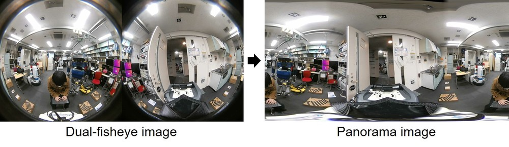
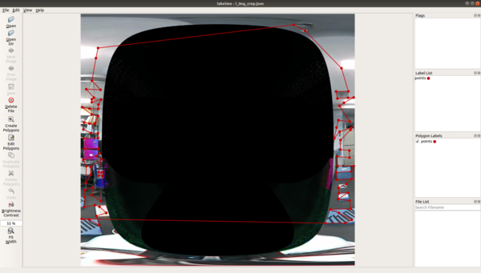
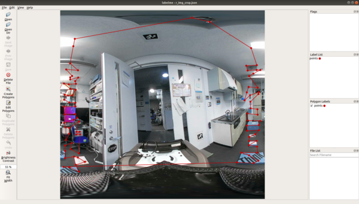

# FisheyeStitcher


Generate panorama image by stitching dual-fisheye camera images.
This is ROS wrapper of [drNoob13/fisheyeStitcher](https://github.com/drNoob13/fisheyeStitcher)

## Subscribing Topic
* `~input` (`sensor_msgs/Image`)

  Input dual-fisheye image.

## Publishing Topic
* `~output` (`sensor_msgs/Image`)

  Output panorama image.

## Parameters
* `~light_compen` (Bool, default: false)

  Light Fall-off Compensation. The outer edge of the fisheye image has low brightness.

* `~refine_align` (Bool, default: false)

  Adjusts any discontinuities caused by objects with varying depth in the stitching boundaries. Note that this process takes a large CPU usage.

* `~fovd` (Double, default: 195.0)

  Field of view of fisheye camera [degree].

* `~save_unwarped` (Bool, default: false)

  Save unwarped (rectified) fisheye images under `~/.ros`. These images are useful to update panorama parameter.

* `~mls_map_path` (String, default: "")

  Path to .yml.gz file which contains MLS grids information. How to generate this file is explained below.

* `~blend_image_height` (Int, default: 1920)

  Image size to be used for panorama blending.

* `~blend_image_width` (Int, default: 1920)

  Image size to be used for panorama blending.

* `~blend_param_p_wid` (Int, default: 55)

  Parameters used for panorama blending.

* `~blend_param_p_x1` (Int, default: 75)

  Parameters used for panorama blending.

* `~blend_param_p_x2` (Int, default: 1775)

  Parameters used for panorama blending.

* `~blend_param_row_start` (Int, default: 590)

  Parameters used for panorama blending.

* `~blend_param_row_end` (Int, default: 1320)

  Parameters used for panorama blending.

* `~output_image_height` (Int, default: 2000)

  Output image size

* `~output_image_height` (Int, default: 2000)

  Output image size

## Sample
Before running the sample, please `catkin build jsk_perception`.

```bash
rosrun jsk_perception install_sample_data.py
rosbag play $(rospack find jsk_perception)/sample/data/insta360_air.bag --loop --clock
roslaunch jsk_perception sample_dual_fisheye_to_panorama.launch
```

Panorama blending will run with high resolution parameters by default. (blending with 3840x1920, output is 4000x2000)
This configuration requires lots of CPU power. If you want to run wih low resolution parameters.

```bash
roslaunch jsk_perception sample_dual_fisheye_to_panorama.launch resolution_mode:=low
```

## Update panorama parameter
This section describes how to update the panorama parameter for generating a panorama image. Note that different cameras basically require different parameters, even if they are of the same type. However, if you're lucky, you can use the parameters of another camera, so you can try that first.

Here is an example using insta360.

1. Unwarp and save the left and right fisheye images. The images are `$HOME/.ros/l_img_crop.jpg` and `$HOME/.ros/r_img_crop.jpg`
```bash
roslaunch jsk_perception sample_insta360_air.launch use_usb_cam:=true save_unwarped:=true
```

2. Annotate the corresponding points of the left and right images. We use [labelme](https://github.com/wkentaro/labelme) as a GUI tool. When annotating, it is easier to start with `l_img_crop.jpg`, which has a narrow angle of view than `r_img_crop.jpg`. `$HOME/.ros/l_img_crop.json` and `$HOME/.ros/r_img_crop.json` should be outputted.
```bash
sudo pip install labelme==4.5.7
labelme $HOME/.ros/l_img_crop.jpg
labelme $HOME/.ros/r_img_crop.jpg
```

  
  


3. Save the correspondence points to a matlab file.
```bash
rosrun jsk_perception create_mls_correspondence.py
```

4. Run `mls_rigid_example2.m` to generate the MLS grids file. matlab can be installed from [the University of Tokyo license](https://jp.mathworks.com/academia/tah-portal/university-of-tokyo-40790257.html). You also need to install the image processing toolbox and the parallel computing toolbox.
Please check the [official wiki](https://github.com/drNoob13/fisheyeStitcher/wiki/How-to-create-the-MLS-%5BX,Y%5D-grids)

```bash
matlab -nodisplay -nosplash -nodesktop -r "run('$(rospack find jsk_perception)/scripts/mls_rigid_example2.m');exit"
```

5. Convert the MLS grid file to a yaml file so that OpenCV can read it.
```bash
rosrun jsk_perception mls_matlab2opencv.py
```

6. Compress the yaml file to gz and place it under jsk_perception.
```bash
gzip ~/.ros/fisheye_stitcher_grid_xd_yd_3840x1920.yml
mv ~/.ros/fisheye_stitcher_grid_xd_yd_3840x1920.yml.gz $(rospack find jsk_perception)/config/fisheye_stitcher_grid_xd_yd_3840x1920.yml.gz
```
