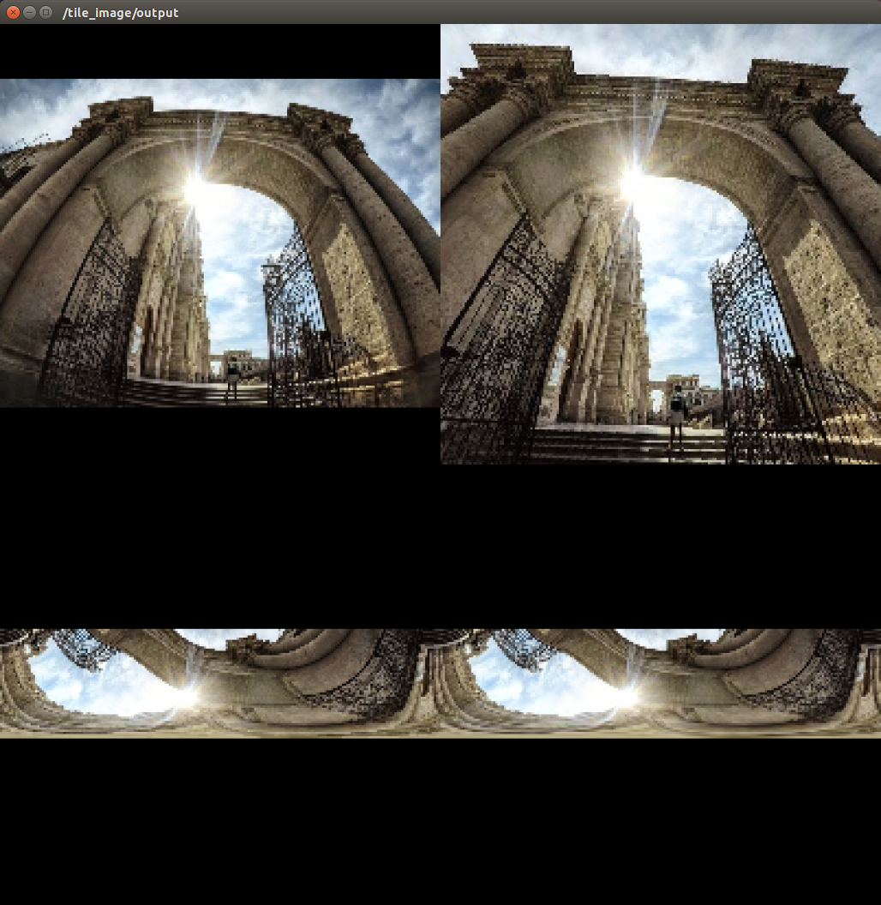
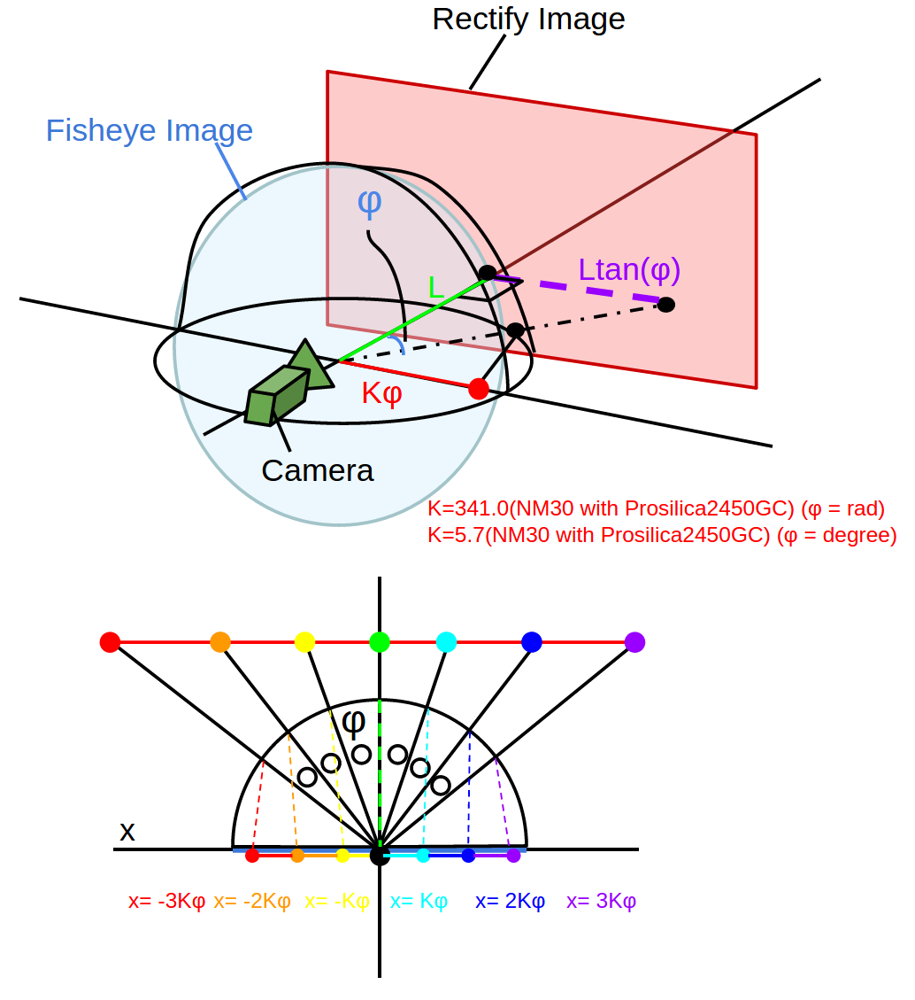

# FisheyeToPanorama



This nodelet will publish Rectified or Panoramized Fisheye Image.

We recommend you to set scale factor as small as possible to reduce calculation.

This was tested with Prosilica GC2450C and NM30 lens.

Below pictures show image rectification system.



## Subscribing Topic
* `~input` (`sensor_msgs/Image`)

  Input image.

## Publishing Topic
* `~output` (`sensor_msgs/Image`)

  Rectified or Panoramized Image

* `~output_bilinear` (`sensor_msgs/Image`)

  When `~use_panorama` and `~simple_panorama` are true, publish Panoramized Image

## Parameters
* `~use_panorama` (Bool, default: `false`)

  If true => publish Panorama View Image

  If false => publish Rectified View Image

* `~simple_panorama` (Bool, default: `false`)

  This is effective only when `~use_panorama` is true

  If true => show Simple Panorama View

  If false => show Calculated Panorama View

* `~degree` (Float, default: `60.0`)

  Field of view of output image.

  This parameter can be changed by `dynamic_reconfigure`.

* `~scale` (Float, default: `0.2`)

  Output image size.

  This parameter can be changed by `dynamic_reconfigure`.

* `~upside_down` (Bool, default: `false`)

  Turn the image upside down.

  This parameter can be changed by `dynamic_reconfigure`.

* `~offset_degree` (Float, default: `180.0`)

  Offset degree for Panorama View.

  This parameter can be changed by `dynamic_reconfigure`.


## Sample

```bash
roslaunch jsk_perception sample_fisheye_to_panorama.launch
```
