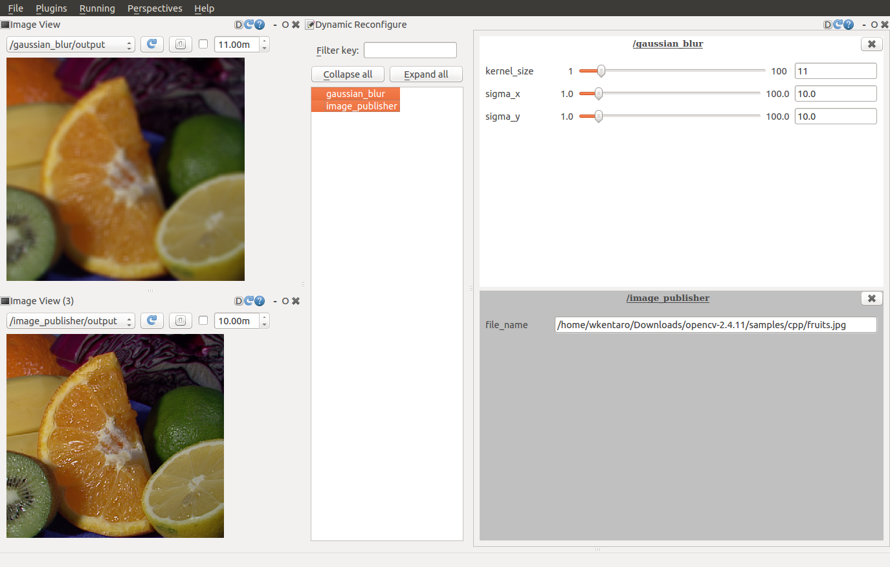

# GaussianBlur


## Subscribing Topic
* `~input` (`sensor_msgs/Image`)

  Input image.

## Publishing Topic
* `~output` (`sensor_msgs/Image`)

  Output transformed image.

## Parameters
* `~kernel_size` (Integer, default: 11)

  Kernel size for blur transform. It should be odd number.

* `~sigma_x`, `~sigma_y` (Double, default: 10)

  Gaussian kernel standard deviation in X or Y direction.


## Sample

```bash
roslaunch jsk_perception sample_gaussian_blur.launch
```
