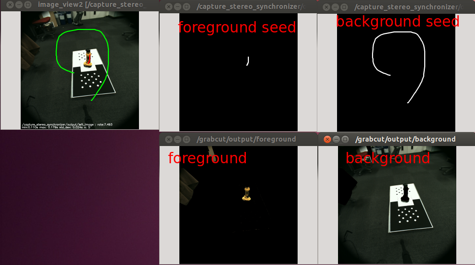

# GrabCut

Input original image and seed of foreground/background
to obtain foreground and background image by applying GrabCut algorithm.



## Subscribing Topic

* `~input` (`sensor_msgs/Image`)

  Input image from which foreground/background will be extracted.

* `~input/foreground` (`sensor_msgs/Image`)
* `~input/background` (`sensor_msgs/Image`)

  Seed mask image defining foreground/background.

## Publishing Topic

* `~output/foreground` (`sensor_msgs/Image`)
* `~output/background` (`sensor_msgs/Image`)

  Foreground/background image extracted from `~input`.

* `~output/foreground_mask` (`sensor_msgs/Image`)
* `~output/background_mask` (`sensor_msgs/Image`)

  Foreground/background mask image extracted from `~input`.


## Parameters

* `~seed_pixel_policy` (Int, default: `0`)

  If `0`, regard pixels in seed mask as absolute foreground/background.

  If `1`, regard pixels in seed mask as probable foreground/background.

  This parameter can be changed by `dynamic_reconfigure`.


## Sample

```bash
roslaunch jsk_perception sample_grabcut.launch
```
