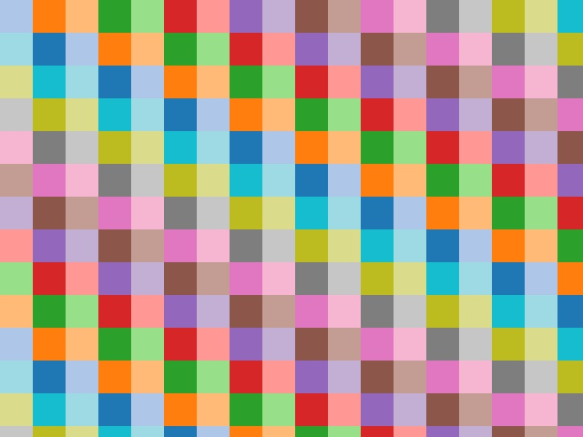

# GridLabel


Generate labels of grid.

## Subscribing Topic
* `~input` (`sensor_msgs/CameraInfo` or `sensor_msgs/Image`)

  Input is `sensor_msgs/CameraInfo` or `sensor_msgs/Image`.
  If `use_camera_info` is true, `sensor_msgs/CameraInfo` will be used.
  If `use_camera_info` is false, `sensor_msgs/Image` will be used.
## Publishing Topic
* `~output` (`sensor_msgs/Image (CV_32SC1)`)

  Output labels as image. Encoding is `CV_32SC1`.
## Parameters
* `~label_size` (Integer, default: `32`)

  label size
* `~use_camera_info` (Boolean, default: `false`)

  if this parameter is true, it uses `sensor_msgs/CameraInfo` for `~input`.

## Sample

```bash
roslaunch jsk_perception sample_grid_label.launch
```
