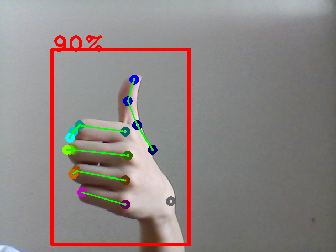

hand_pose_estimation_2d.py
==========================

What is this?
-------------

Estimate hand pose in 2d.
Please refer to `original paper <https://www.yangangwang.com/papers/WANG-SRH-2019-07.html>`_.

In order to use this feature, you need to install `pytorch <https://pytorch.org/get-started/locally/>`_ (pytorch >= 1.4.0 is recommended).

Subscribing Topic
-----------------

* ``~input`` (``sensor_msgs/Image``)

  Input image.

* ``~input/depth`` (``sensor_msgs/Image``)

  Input depth image.

* ``~input/info`` (``sensor_msgs/CameraInfo``)

  Input camera info.

  
Publishing Topic
----------------

* ``~output/vis`` (``sensor_msgs/Image``)

  Visualization image of detected hand poses.

* ``~output/pose`` (``jsk_recognition_msgs/HandPoseArray``)

  If ``with_depth`` is true, publish 3D joint position.

  If ``with_depth`` is false, publish 2D joint position in image.

* ``~output/pose_2d`` (``jsk_recognition_msgs/HandPoseArray``)

  If ``with_depth`` is true, publish 2D joint position.

  
Parameters
----------

* ``~gpu`` (Int, Default: ``-1``)

  GPU id. ``-1`` represents CPU mode.

* ``~thre1`` (Float, Default: ``0.3``)

  Threshold of hand bounding box heatmap value.

* ``~thre2`` (Float, Default: ``0.2``)

  Threshold of hand keypoint heatmap value.

* ``~thre3`` (Int, Default: ``5``)

  Threshold of undetected keypoints quantity.

* ``~visualize`` (Bool, Default: ``True``)

  If ``~visualize`` is true, draw estimated hand keypoints.

* ``~model_file`` (String, Required)

  Trained `SRHandNet model file <https://www.yangangwang.com/papers/WANG-SRH-2019-07.html>`_.

* ``~with_depth`` (Bool, Default: ``False``)

  If true, subscribe ``~input/depth`` and ``~input/info``.

* ``~sync_camera_info`` (Bool, Default: ``False``)

  Synchronize ``~input/info`` if enabled, otherwise the last received camera info message is used.

* ``~approximate_sync`` (Bool, Default: ``True``)

  Use approximate synchronization policy.

* ``~queue_size`` (Int, Default: ``10``)

  Queue size for synchronization.

* ``~slop`` (Float, Default: ``0.1``)

  Slop for approximate sync.

  
Example
-------

For 2d hand pose detection.

.. code-block:: bash

   roslaunch jsk_perception sample_hand_pose_estimation_2d.launch gpu:=0

For 3d hand pose detection.

.. code-block:: bash

   roslaunch jsk_perception sample_hand_pose_estimation_3d.launch gpu:=0

Reference
---------

::

  @article{Wang:2019:SRH,
    doi = {10.1109/TIP.2019.2955280},
    title = {SRHandNet: Real-time 2D Hand Pose Estimation with Simultaneous Region Localization},
    journal = {IEEE Transactions on Image Processing},
    author = {Yangang Wang, Baowen Zhang and Cong Peng},
    number = 1,
    month = Oct.,
    volume = 29,
    year = 2019,
    pages = {2977 - 2986},
    url = {http://yangangwang.com/papers/WANG-SRH-2019-07.html},
  }
