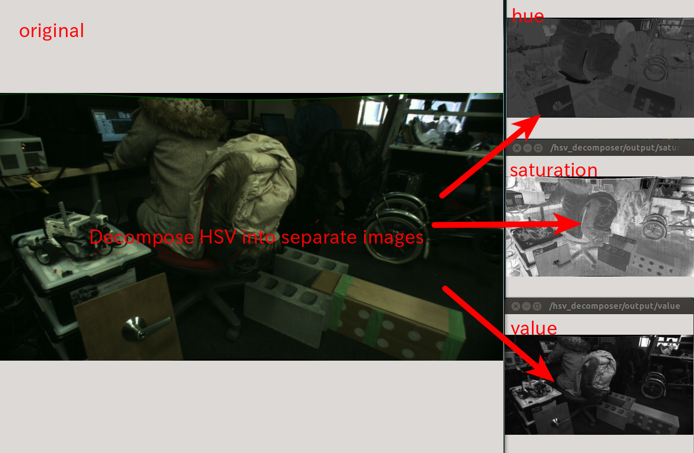

# HSVDecomposer


Split the original color image into 3 greyscale image of each color(HSV) strength.

## Subscribing Topic
* `~input` (`sensor_msgs/Image`)

  Divide input camera image into 3 image (H,S,V) according to its color info.

## Publishing Topic
* `~output/hue` (`sensor_msgs/Image`)
* `~output/saturation` (`sensor_msgs/Image`)
* `~output/value` (`sensor_msgs/Image`)

## Parameters
none

## Samples

```bash
roslaunch jsk_perception sample_hsv_decomposer.launch
```
