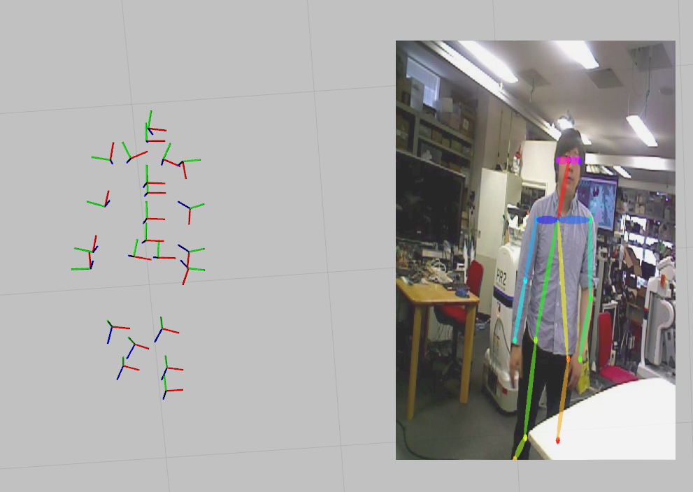

human_mesh_recovery.py
======================

What is this?
-------------

Ros Wrapper of Human Mesh Recovery.
See: End-to-end Recovery of Human Shape and Pose (`https://arxiv.org/abs/1712.06584`)

Subscribing Topic
-----------------

* ``~input`` (``sensor_msgs/Image``)

  Input image.

* ``~input/pose`` (``jsk_recognition_msgs/PeoplePoseArray``)

  Input 2d people pose array.
  This is used only when param ``~with_people_pose`` is ``true``.

Publishing Topic
----------------

* ``~output/pose`` (``jsk_recognition_msgs/PeoplePoseArray``)

  Estimated 3d people pose array.

Parameters
----------

* ``~gpu`` (Int, Default: ``-1``)

  GPU id. ``-1`` represents CPU mode.

* ``~num_stage`` (Int, Default: ``3``)

  Number of stage size (forwarding iteration count).

* ``~smpl_model_file`` (String, Required)

  Trained SMPL model file path.

* ``~resnet_v2_50_model_file`` (String, Required)

  Trained ResNet_V2_50 model file path.

* ``~encoder_model_file`` (String, Required)

  Trained Encoder model file path.

* ``~with_people_pose`` (Bool, Default: ``False``)

  If this param is ``true``, subscribe ``~input/poes``.

* ``~approximate_sync`` (Bool, Default: ``True``)

  Use approximate synchronization policy.
  This is used only when param ``~with_people_pose`` is ``true``.

* ``~queue_size`` (Int, Default: ``10``)

  How many messages you allow about the subscriber to keep in the queue.
  This should be big when there is much difference about delay between two topics.
  This is used only when param ``~with_people_pose`` is ``true``.

* ``~slop`` (Float, Default: ``0.1``)

  Slop for approximate sync.
  This is used only when param ``~with_people_pose`` and ``~approximate_sync`` are ``true``.

Example
-------

.. code-block:: bash

   roslaunch jsk_perception sample_human_mesh_recovery.launch gpu:=0
