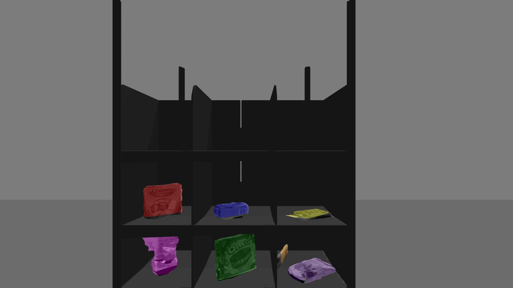

image_cluster_indices_decomposer.py
===================================

What is this?
-------------

Publish an image topic to which cluster of image indices is colorized.

Subscribing Topic
-----------------

* ``~input`` (``sensor_msgs/Image``)

  Raw image.

* ``~input/cluster_indices`` (``jsk_recognition_msgs/ClusterPointIndices``)

  Cluster of indices to visualize.

Publishing Topic
----------------

* ``~output`` (``sensor_msgs/Image``)

  Visualized image with colorized region which is assigned with the indices.

Parameters
----------

* ``~approximate_sync`` (Bool, default: ``False``)

  Whether to use approximate for input topics.

* ``~queue_size`` (Int, default: ``100``)

  How many messages you allow about the subscriber to keep in the queue.
  This should be big when there is much difference about delay between two topics.

* ``~slop`` (Float, default: ``0.1``)

  How many seconds you allow about the difference of timestamp
  when you specify ``~approximate_sync``.
