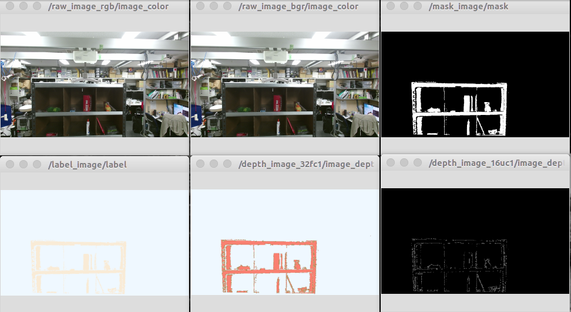

# image_publisher.py



Publish image from loaded file.

## Publishing Topics
* `~output` (`sensor_msgs/Image`)

* `~output/camera_info` (`sensor_msgs/CameraInfo`)

## Parameters
* `~file_name` (str default: `image.png`)

  full path to the file to be loaded
* `~publish_info` (bool default: `True`)

  publish `~output/camera_info` if true

* `~encoding` (str default: `bgr8`)
* `~frame_id` (str default: `camera`)
* `~rate` (Float default: `1.0`)

* `~fovx` (Float default: `None`)
* `~fovy` (Float default: `None`)

  If `~publish_info` is `True` and `~fovx`[degree] and `~fovy`[degree] are specified,
  calculate camera intrinsic parameter and publish it as a values of
  `~output/camera_info`.

## Sample

```bash
roslaunch jsk_perception sample_image_publisher.launch
```
