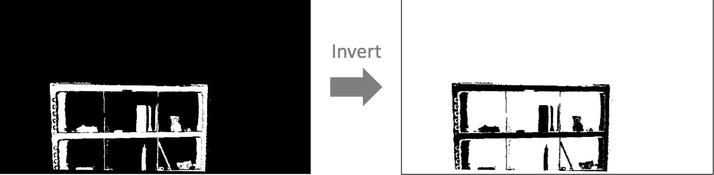

# InvertMaskImage



Inverts the input mask image.

## Subscribing Topic

* `~input` (`sensor_msgs/Image`)

  Input mask image.

## Publishing Topic

* `~output` (`sensor_msgs/Image`)

  Inverted mask image.

## Parameters

* `~queue_size` (Int, default: `1`)

  How many messages you allow about the subscriber to keep in the queue.

## Sample

```bash
roslaunch jsk_perception sample_invert_mask_image.launch
```
