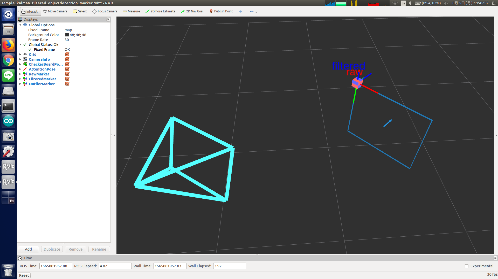

# kalman-filtered-objectdetection-marker.l



## What is this?

Apply kalman filter to `posedetection_msgs/ObjectDetection` message and show marker.


## Subscribing Topic

* `input/ObjectDetection` (`posedetection_msgs/ObjectDetection`)

  Result of object detection.

* `input/image` (`sensor_msgs/Image`)

  Trigger topic to publish dummy pose to `attention_clipper/input/pose`.

* `input/switch` (`std_msgs/Bool`)

  Whether to subscribe `input/ObjectDetection`.


## Publishing Topics

* `object_detection_marker_array` (`visualization_msgs/MarkerArray`)

  Marker of raw pose.

* `filtered` (`visualization_msgs/MarkerArray`)

  Marker of filtered pose.

* `outlier` (`visualization_msgs/MarkerArray`)

  Marker of outlier.

* `attention_clipper/input/pose` (`geometry_msgs/PoseStamped`)

  Pose of detected object.

* `posewithcovstamped` (`geometry_msgs/PoseWithCovarianceStamped`)
* `simplecov` (`geometry_msgs/PoseWithCovarianceStamped`)

  Pose of detected object with covariance.


## Advertising Service

* `targetobj` (`posedetection_msgs/TargetObj`)

  Service API to return object pose.


## Parameters

* `~object_width` (Float, default: `0`)
* `~object_height` (Float, default: `0`)

  Width/height of object.

* `~relative_pose` (String, default: `0 0 0 0 0 0 1`)

  Relative pose.

* `~detection_topic` (String, default: `/kinect_head/rgb/ObjectDetection`)

  This parameter is not used for now.

* `~marker_life` (Float, default: `300`)

  Life time of marker in seconds.

* `~base_frame_id` (String, default: `/base_footprint`)

  Frame ID of base.

* `~target_type` (String, default: `""`)

  Target type.


## Sample

```bash
roslaunch jsk_perception sample_kalman_filtered_objectdetection_marker.launch
```
