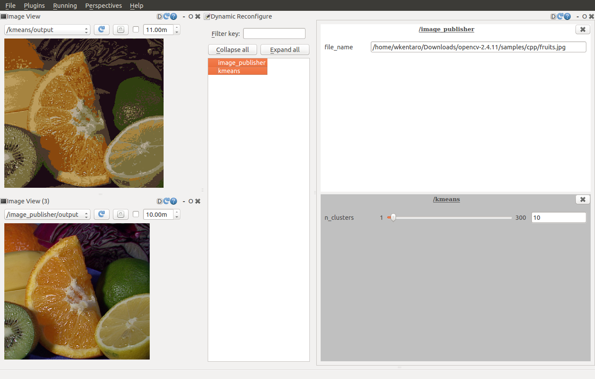

# Kmeans

Apply Kmeans clustering to the input image.

## Subscribing Topic
* `~input` (`sensor_msgs/Image`)

  Input image.

## Publishing Topic
* `~output` (`sensor_msgs/Image`)

  Output transformed image.

## Parameters
* `~n_clusters` (Integer, default: `10`)

  Number of clusters in Kmeans clustering.

