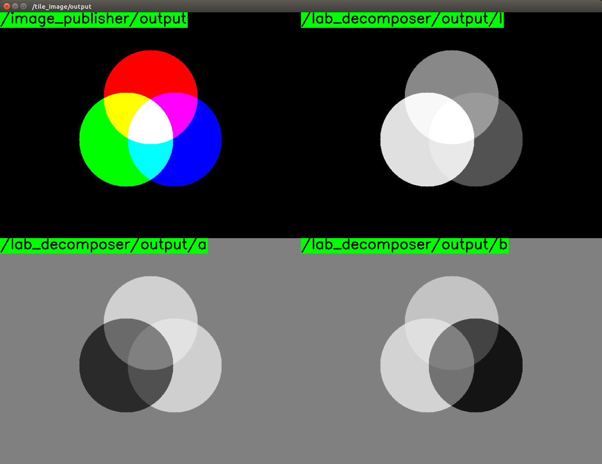

# LabDecomposer



Decompose BGR/RGB image into separate planes in [CIE-Lab color space](http://en.wikipedia.org/wiki/Lab_color_space).

## Subscribing Topic
* `~input` (`sensor_msgs/Image`)

  Input image.

## Publishing Topic
* `~output/l` (`sensor_msgs/Image`)
* `~output/a` (`sensor_msgs/Image`)
* `~output/b` (`sensor_msgs/Image`)

  L*, a and b separated planes. Each image has CV_8U encoding.


## Sample

```bash
roslaunch jsk_perception sample_lab_decomposer.launch
```
