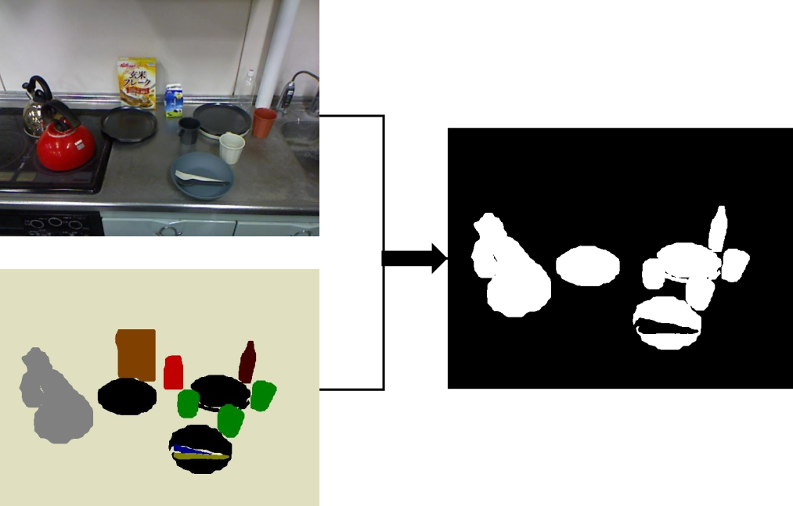

LabelArrayToMaskImage
=====================

What is this?
-------------

Convert a label image to mask image.

Subscribing Topic
-----------------

* ``~input`` (``sensor_msgs/Image``)

  Input label image.

Publishing Topic
----------------

**Default Topics**

* ``~output`` (``sensor_msgs/Image``)

  Output mask image.

Parameters
----------

* ``~label_values`` (``List[int]``, default: ``[]``)

  List of label values.
  The specified label value will be converted to a mask image.

Sample
------

.. code-block:: bash

  roslaunch jsk_perception sample_label_array_to_mask_image.launch
