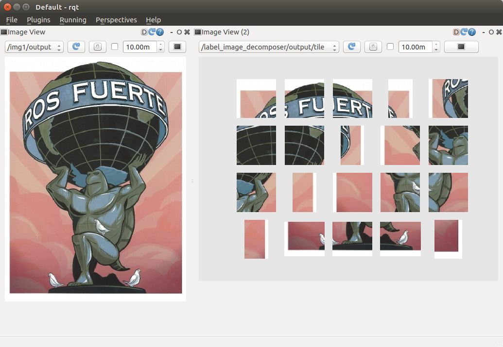

label_image_decomposer.py
=========================

What is this?
-------------

Publish an image topic to which tile mask applied and tile image with decomposed with label.

Subscribing Topic
-----------------

* ``~input`` (``sensor_msgs/Image``)

  Raw image.

* ``~input/label`` (``sensor_msgs/Image``)

  Label image to decompose the input raw image with.

Publishing Topic
----------------

**Default Topics**

* ``~output`` (``sensor_msgs/Image``)

  Label image mask applied image.

* ``~output/label_viz`` (``sensor_msgs/Image``)

  Applied label to raw image to visualize.
  It computes the average pixel value of each label and draw with edge line.
  If parameter ``~label_names`` is specified,
  the label names are also drawn as a legend.

**Optional Topics**

* ``~output/tile`` (``sensor_msgs/Image``)

  Tile image listing decomposed images.
  This is published when ``~publish_tile`` is ``True``. See **Parameters**

* ``~output/fg_mask``, ``~output/bg_mask`` (``sensor_msgs/Image``)

  Mask image for foreground and background according to the value of label.
  Currently, it assumes ``0`` value is background label.
  This is published when ``~publish_mask`` is ``True``. See **Parameters**

Parameters
----------

* ``~approximate_sync`` (Bool, default: ``False``)

  Whether to use approximate for input topics.

* ``~publish_tile`` (Bool, default: ``False``)

  Whether to publish tile image with decomposed images.

* ``~publish_mask`` (Bool, default: ``False``)

  Whether to publish fore/background mask images.

* ``~queue_size`` (Int, default: ``10``)

  How many messages you allow about the subscriber to keep in the queue.
  This should be big when there is much difference about delay between two topics.

* ``~bg_label`` (Int, default: ``0``)

  Background label which is not colorized.

* ``~slop`` (Float, default: ``0.1``)

  How many seconds you allow about the difference of timestamp
  when you specify ``~approximate_sync``.

* ``~label_names`` (List of String, default: ``[]``)

  The name of labels, and if this parameter is specified, the ``~output/label_viz``
  image is drawn with label name legend.

* ``~only_label`` (Bool, default: ``False``)

  If ``True``, ``~input`` is not subscribed and ``~input/label`` is only used
  to visualize the input label.

* ``~alpha`` (Float, default: ``0.3``)

  Ratio of label color when overlaying label image on input rgb image:
  label_color * alpha + rgb2gray(rgb) * (1 - alpha).
  Note that this parameter is not used if ``~only_label`` is ``True``.

Sample
------

.. code-block:: bash

  roslaunch jsk_perception sample_label_image_decomposer.launch
