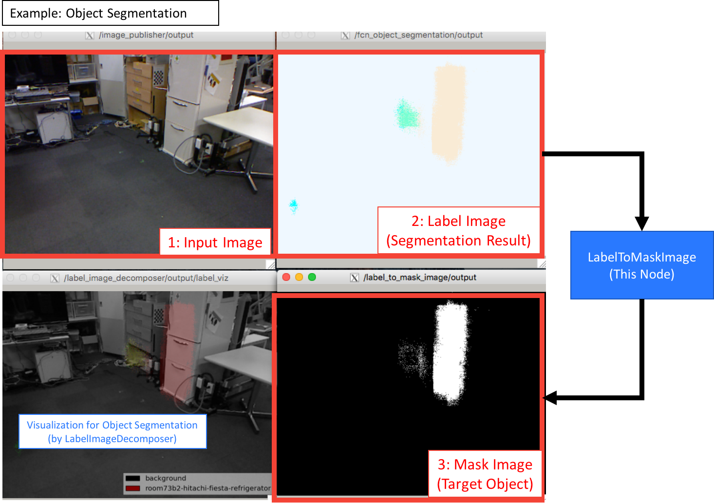

LabelToMaskImage
================

What is this?
-------------

Convert label image to mask image with specified label value with rosparam.

Subscribing Topic
-----------------

* ``~input`` (``sensor_msgs/Image``)

  Label image.

Publishing Topic
----------------

* ``~output`` (``sensor_msgs/Image``)

  Mask image.

Parameters
----------

* ``~label_value`` (``Int``, default: ``0``)

  Label value whose region will be converted to mask image.

Sample
------

.. code-block:: bash

  roslaunch jsk_perception sample_label_to_mask_image.launch
