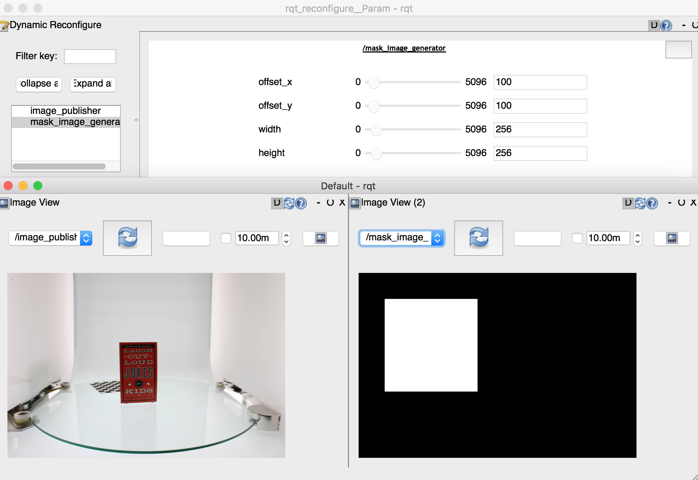

# MaskImageGenerator



Simply generate a mask image according to ~input image and dynamic reconfigure parameters.

## Subscribing Topic
* `~input` (`sensor_msgs/Image`)

  Input image and it's used to know original width and height.

## Publishing Topic
* `~output` (`sensor_msgs/Image`)

  Output mask image.

## Parameters
* `~offset_x` (Int, default: `0`)
* `~offset_y` (Int, default: `0`)
* `~width` (Int, default: `256`)
* `~height` (Int, default: `256`)
  Coordinates of top left point and size of mask image.

## Sample

```bash
roslaunch jsk_perception sample_mask_image_generator.launch
```
